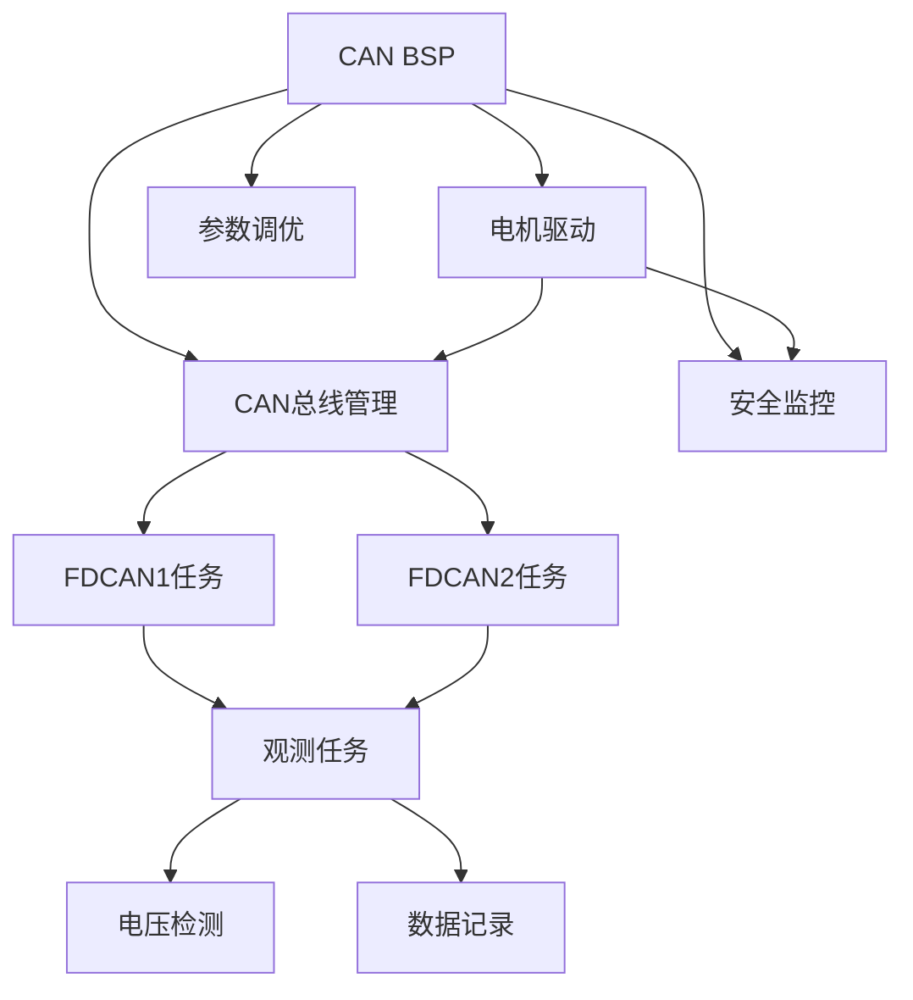

# Ludan Control Board - 开发计划

## 📋 版本规划概述

本项目采用分版本迭代开发策略，从最小可行产品（MVP）开始，逐步增强功能和完善系统。

### 版本划分策略

- **版本1.0 (MVP)**: 基础CAN通信、多电机控制
  - 目标：实现基本的双CAN总线电机控制功能
  - 核心功能：CAN通信、电机驱动、基本控制循环
  
- **版本2.0 (增强)**: 参数调优、数据记录
  - 目标：增强系统功能和可维护性
  - 核心功能：在线调参、数据记录、算法优化
  
- **版本3.0 (扩展)**: 安全机制、高级功能
  - 目标：完善安全保护和扩展功能
  - 核心功能：安全监控、故障诊断、高级控制

### 开发原则

1. **依赖关系优先**: 按照模块依赖关系确定开发顺序
2. **并行开发**: 独立模块可以并行开发
3. **测试驱动**: 每个任务包含测试单元编写阶段
4. **文档同步**: 开发过程中同步更新文档

---

## 🧪 测试策略

### 测试层次

**单元测试**:
- 测试框架: Unity (C语言单元测试框架)
- 覆盖率要求: 关键函数 ≥80%
- 测试环境: PC端模拟（使用Mock HAL库）
- 测试内容: 函数功能、边界条件、错误处理

**集成测试**:
- 测试环境: 硬件在环（HIL）
- 测试内容: 模块间接口、数据流、时序
- 测试工具: CAN分析仪、示波器、逻辑分析仪

**系统测试**:
- 测试环境: 完整硬件系统
- 测试内容: 端到端功能、性能、稳定性
- 测试时长: 连续运行24小时

### 测试用例模板

```c
// 单元测试用例模板
void test_function_name_normal_case(void) {
    // 准备测试数据
    // 执行函数
    // 验证结果
    TEST_ASSERT_EQUAL(expected, actual);
}

void test_function_name_boundary_case(void) {
    // 测试边界条件
}

void test_function_name_error_case(void) {
    // 测试错误处理
}
```

### 测试环境要求

| 测试类型 | 硬件要求 | 软件要求 | 工具要求 |
|---------|---------|---------|---------|
| 单元测试 | PC | Unity框架 | 编译器 |
| 集成测试 | 开发板 | HAL库 | CAN分析仪 |
| 系统测试 | 完整系统 | 所有模块 | 示波器、逻辑分析仪 |

---

## ⚠️ 风险评估

### 技术风险

| 风险项 | 风险等级 | 影响 | 应对措施 |
|--------|---------|------|---------|
| CAN通信不稳定 | 中 | 电机控制失效 | 增加重试机制、超时检测 |
| 实时性无法保证 | 高 | 控制性能下降 | 优化关键路径、调整任务优先级 |
| 内存溢出 | 中 | 系统崩溃 | 内存使用监控、堆栈检查 |
| 电机使能失败 | 中 | 部分电机无法工作 | 增加重试次数、故障上报 |
| Flash写入失败 | 低 | 参数无法保存 | 增加校验、备份机制 |

### 进度风险

| 风险项 | 风险等级 | 影响 | 应对措施 |
|--------|---------|------|---------|
| 任务依赖阻塞 | 中 | 开发延期 | 提前识别依赖、并行开发独立模块 |
| 测试时间不足 | 中 | 质量问题 | 测试与开发并行、自动化测试 |
| 硬件问题 | 高 | 开发停滞 | 准备备用硬件、模拟器开发 |

### 应对策略

**风险缓解**:
- 提前识别高风险任务
- 准备备选技术方案
- 建立问题跟踪机制

**风险监控**:
- 每周风险评估会议
- 关键节点检查
- 问题及时上报

---

## 🎯 里程碑定义

### 版本1.0里程碑

**里程碑1.1 - 基础CAN通信完成** (TASK001完成)
- 验收标准:
  - CAN配置函数通过单元测试
  - CAN发送/接收功能正常
  - 通过集成测试（与CAN分析仪通信）

**里程碑1.2 - 电机驱动完成** (TASK002完成)
- 验收标准:
  - 支持所有7种电机型号
  - 编码/解码精度满足要求
  - 通过单元测试和集成测试

**里程碑1.3 - 多电机控制完成** (TASK004, TASK005完成)
- 验收标准:
  - 双CAN总线同时工作
  - 32个电机同时控制
  - 控制周期稳定在1ms

**里程碑1.4 - MVP版本完成** (所有1.0任务完成)
- 验收标准:
  - 所有功能测试通过
  - 性能指标满足要求
  - 文档完整
  - 连续运行24小时无故障

### 版本2.0里程碑

**里程碑2.1 - 参数调优完成** (TASK008完成)
- 验收标准:
  - 支持在线调参
  - 参数保存/加载功能正常
  - 通过功能测试

**里程碑2.2 - 数据记录完成** (TASK009完成)
- 验收标准:
  - 数据记录功能正常
  - 数据格式正确
  - 通过功能测试

### 版本3.0里程碑

**里程碑3.1 - 安全机制完成** (TASK010完成)
- 验收标准:
  - 所有安全功能正常
  - 故障检测准确
  - 通过安全测试

### 交付物清单

**版本1.0交付物**:
- [ ] 源代码（完整功能）
- [ ] 编译后的固件（.bin, .hex）
- [ ] 技术文档（README.md）
- [ ] 开发文档（DEV_PLAN.md）
- [ ] 测试报告
- [ ] 用户手册（可选）

---

## ✅ 代码审查清单

### 代码质量检查

- [ ] **命名规范**: 函数、变量命名符合规范（下划线命名法）
- [ ] **注释完整**: 所有公共函数有Doxygen注释
- [ ] **函数长度**: 单个函数不超过100行
- [ ] **圈复杂度**: 函数圈复杂度 ≤10
- [ ] **代码重复**: 无重复代码（DRY原则）
- [ ] **魔数消除**: 所有常量使用宏定义或枚举

### 安全性检查

- [ ] **缓冲区溢出**: 所有数组访问有边界检查
- [ ] **空指针检查**: 指针使用前检查NULL
- [ ] **资源泄漏**: 动态分配的内存正确释放
- [ ] **整数溢出**: 整数运算检查溢出
- [ ] **除零检查**: 除法运算检查除数为0

### 性能检查

- [ ] **算法复杂度**: 关键路径算法复杂度合理
- [ ] **内存使用**: 内存使用在限制范围内
- [ ] **实时性**: 关键函数执行时间满足要求
- [ ] **优化**: 关键路径代码已优化

### 可维护性检查

- [ ] **模块化**: 代码模块化程度高
- [ ] **耦合度**: 模块间耦合度低
- [ ] **可测试性**: 函数易于单元测试
- [ ] **文档**: 代码文档完整

---

## 🚀 版本1.0 - MVP (最小可行产品)

### 版本目标

实现基础的CAN总线通信和多电机控制功能，能够通过双CAN总线控制最多32个电机（每条总线16个）。

### 任务列表

#### TASK001 - CAN总线BSP模块

**任务名称**: CAN总线板级支持包  
**所属版本**: 1.0  
**状态**: 计划中  
**依赖任务**: 无  
**功能模块路径**: `User/Bsp/can_bsp.c`, `User/Bsp/can_bsp.h`

**功能描述**:  
实现CAN总线的底层配置、数据发送和接收功能，为上层应用提供统一的CAN通信接口。

**子任务清单**:

1. **FDCAN1_Config()** - FDCAN1总线配置
   - 功能：配置FDCAN1的过滤器、启动CAN、激活接收中断
   - 输入：无
   - 输出：无（通过Error_Handler处理错误）
   - AI提示词：见下方

2. **FDCAN2_Config()** - FDCAN2总线配置
   - 功能：配置FDCAN2的过滤器、启动CAN、激活接收中断
   - 输入：无
   - 输出：无（通过Error_Handler处理错误）
   - AI提示词：见下方

3. **canx_send_data()** - CAN数据发送
   - 功能：通过指定CAN总线发送数据，支持重试机制
   - 输入：CAN句柄、CAN ID、数据缓冲区、数据长度
   - 输出：0成功，1失败
   - AI提示词：见下方

**AI提示词模板**:

```
你是一个STM32嵌入式系统开发专家。请实现以下函数：

**上下文信息**:
- 项目路径: User/Bsp/can_bsp.c, User/Bsp/can_bsp.h
- 依赖模块: HAL库 (fdcan.h), FreeRTOS (cmsis_os2.h)
- 相关文件: 
  - Core/Inc/fdcan.h (HAL FDCAN定义)
  - User/Bsp/can_bsp.h (接口定义)

**函数要求**:
函数名: [函数名]
函数签名: [函数签名]
功能描述: [功能描述]

**技术要求**:
1. 使用STM32 HAL库的FDCAN接口
2. 支持FreeRTOS环境（使用osDelay）和非RTOS环境（使用HAL_Delay）
3. 错误处理：调用Error_Handler()处理HAL错误
4. CAN配置：
   - 标准ID范围：0x11-0x1F
   - 支持CAN FD模式，BRS使能
   - 数据长度：支持8/12/16/20/24/48/64字节

**代码风格要求**:
1. 函数命名：使用下划线命名法，全小写
2. 变量命名：使用下划线命名法，全小写
3. 注释：使用Doxygen风格，包含@brief, @param, @retval
4. 缩进：使用4个空格
5. 大括号：K&R风格（开括号不换行）

**错误处理要求**:
1. 所有HAL函数调用必须检查返回值
2. HAL_OK以外的返回值调用Error_Handler()
3. 发送失败返回1，成功返回0
4. 发送重试最多100次，每次延迟1ms

**测试要求**:
1. 单元测试：测试正常发送、FIFO满、超时情况
2. 集成测试：与真实CAN总线通信测试
3. 性能测试：测试发送延迟和吞吐量

**验收标准**:
1. 函数编译通过，无警告
2. 通过单元测试
3. 通过集成测试
4. 代码符合风格要求
5. 错误处理完整

请实现该函数，并提供完整的代码。
```

**AI提示词示例：FDCAN1_Config()**

```
你是一个STM32嵌入式系统开发专家。请实现FDCAN1_Config函数。

**上下文信息**:
- 项目路径: User/Bsp/can_bsp.c, User/Bsp/can_bsp.h
- 依赖模块: HAL库 (fdcan.h), FreeRTOS (cmsis_os2.h)
- 相关文件:
  - Core/Inc/fdcan.h (HAL FDCAN定义)
  - User/Bsp/can_bsp.h (接口声明)

**函数要求**:
- 函数名: FDCAN1_Config
- 函数签名: void FDCAN1_Config(void);
- 功能: 配置FDCAN1过滤器、全局过滤器，启动FDCAN1，并启用FIFO0新消息中断

**技术要求**:
1. 过滤器: 标准ID范围0x11-0x1F，使用FDCAN_FILTER_RANGE，目标FIFO0
2. 全局过滤: 远程帧全部拒绝
3. 启动FDCAN: HAL_FDCAN_Start
4. 中断: FDCAN_IT_RX_FIFO0_NEW_MESSAGE

**代码风格要求**:
- 注释: Doxygen格式，说明配置步骤
- 错误处理: HAL返回非HAL_OK时调用Error_Handler()

**错误处理要求**:
- 所有HAL调用均检查返回值，失败时立即调用Error_Handler()

**测试要求**:
- 单元测试: 使用HAL模拟接口验证函数调用顺序
- 集成测试: 通过CAN分析仪确认过滤器生效

请参考以下示例结构完成函数:

```c
void FDCAN1_Config(void) {
    FDCAN_FilterTypeDef sFilterConfig = {0};

    sFilterConfig.IdType = FDCAN_STANDARD_ID;
    sFilterConfig.FilterIndex = 0;
    sFilterConfig.FilterType = FDCAN_FILTER_RANGE;
    sFilterConfig.FilterConfig = FDCAN_FILTER_TO_RXFIFO0;
    sFilterConfig.FilterID1 = 0x11;
    sFilterConfig.FilterID2 = 0x1F;
    if (HAL_FDCAN_ConfigFilter(&hfdcan1, &sFilterConfig) != HAL_OK) {
        Error_Handler();
    }

    // TODO: 配置全局过滤器、启动FDCAN、激活通知
}
```

请补全上述TODO部分并添加必要的注释。
```

**AI提示词示例：FDCAN2_Config()**

```
实现FDCAN2_Config函数，要求与FDCAN1_Config类似，但:
- 过滤器输出到FIFO1
- 激活FDCAN_IT_RX_FIFO1_NEW_MESSAGE中断
- 使用hfdcan2句柄
请提供完整代码并遵循相同的错误处理策略。
```

**AI提示词示例：canx_send_data()**

```
实现canx_send_data函数。

**功能**:
- 根据数据长度设置DLC（支持8/12/16/20/24/48/64字节）
- 启用CAN FD和BRS
- 当发送FIFO满时等待1ms再重试，最多100次

**伪代码**:
```c
for (attempt = 0; attempt < FDCAN_TX_MAX_ATTEMPTS; ++attempt) {
    if (HAL_FDCAN_GetTxFifoFreeLevel(hcan) == 0U) {
        fdcan_tx_delay(FDCAN_TX_RETRY_DELAY_MS);
        continue;
    }
    if (HAL_FDCAN_AddMessageToTxFifoQ(...) == HAL_OK) {
        return 0;
    }
    fdcan_tx_delay(FDCAN_TX_RETRY_DELAY_MS);
}
return 1;
```

**测试**:
- 单元测试: 模拟FIFO满、发送成功、失败重试
- 集成测试: 实际发送CAN帧并用分析仪验证
```

---

#### TASK002 - 电机驱动模块

**任务名称**: DM电机驱动  
**所属版本**: 1.0  
**状态**: 计划中  
**依赖任务**: TASK001  
**功能模块路径**: `User/Devices/DM_Motor/motor_config.c`, `User/Devices/DM_Motor/motor_config.h`

**功能描述**:  
实现DM系列电机的驱动功能，包括电机初始化、使能/禁用、控制命令发送、反馈数据解析。

**子任务清单**:

| 序号 | 子任务 | 功能描述 | 输入 | 输出/副作用 |
|------|--------|----------|------|-------------|
| 1 | joint_motor_init() | 初始化Joint_Motor_t结构体，设置ID、模式、默认参数 | motor指针、ID、模式 | 更新motor结构体 |
| 2 | enable_motor_mode() | 发送使能命令，等待反馈确认 | CAN句柄、motor_id、mode_id | 电机进入目标模式 |
| 3 | disable_motor_mode() | 发送禁用命令 | CAN句柄、motor_id、mode_id | 电机退出控制模式 |
| 4-8 | mit_ctrl*() | 针对不同型号电机的MIT控制命令封装 | CAN句柄、目标参数 | 通过CAN发送控制帧 |
| 9-15 | dm****_fbdata() | 解析各型号电机的反馈数据，更新motor->para | 电机结构体、CAN数据、长度 | 更新反馈参数 |
| 16 | float_to_uint() | 将浮点数按范围量化到指定位宽 | 浮点值、最小/最大值、位数 | 整数编码 |
| 17 | uint_to_float() | 将整数恢复为浮点值 | 整数值、最小/最大值、位数 | 浮点解码 |

**AI提示词模板**:

```
你是一个STM32嵌入式系统开发专家。请实现以下函数：

**上下文信息**:
- 项目路径: User/Devices/DM_Motor/motor_config.c, motor_config.h
- 依赖模块: CAN BSP (can_bsp.h), 工具库 (user_lib.h)
- 相关文件:
  - User/Bsp/can_bsp.h (CAN发送接口)
  - User/Devices/DM_Motor/motor_config.h (数据结构定义)

**函数要求**:
函数名: [函数名]
函数签名: [函数签名]
功能描述: [功能描述]

**技术要求**:
1. 支持7种DM电机型号（4310, 4340, 6006, 8006, 3507, 10010L, 6248P）
2. 每种电机有不同的参数范围（位置、速度、力矩、刚度、阻尼）
3. 数据编码：使用float_to_uint将浮点数编码为整数
4. 数据解码：使用uint_to_float将整数解码为浮点数
5. CAN通信：使用canx_send_data发送控制命令

**代码风格要求**:
1. 函数命名：使用下划线命名法
2. 注释：Doxygen风格，详细说明参数范围
3. 数据验证：检查参数是否在有效范围内
4. 错误处理：参数无效时使用默认值或返回错误

**错误处理要求**:
1. 检查CAN发送返回值
2. 验证参数范围（使用motor_config.h中的MIN/MAX宏）
3. 反馈数据长度验证（必须为8字节）
4. 状态码检查（state字段）

**测试要求**:
1. 单元测试：测试参数编码/解码精度
2. 集成测试：与真实电机通信测试
3. 边界测试：测试参数边界值

**验收标准**:
1. 支持所有7种电机型号
2. 编码/解码精度满足要求
3. 通过所有测试
4. 代码符合风格要求

请实现该函数。
```

**AI提示词示例：mit_ctrl()**

```
实现DM4310电机的MIT模式控制函数。

**函数签名**:
void mit_ctrl(hcan_t *hcan, uint16_t motor_id, float pos,
              float vel, float kp, float kd, float torq);

**实现要点**:
1. 使用float_to_uint将pos/vel/torq、kp/kd编码为整数（位宽参考motor_config.h）
2. 组装8字节控制帧：位置、速度、力矩、KP、KD按协议排列
3. 调用canx_send_data发送，CAN ID = 0x200 + motor_id
4. 对输入参数做范围检查（VAL_LIMIT或float_constrain）
5. 异常处理：canx_send_data返回1时记录错误或重试

**代码参考**:
```c
uint16_t p_int = float_to_uint(pos, P_MIN1, P_MAX1, 16);
uint16_t v_int = float_to_uint(vel, V_MIN1, V_MAX1, 12);
// ... 组帧、发送
```

**测试要求**:
- 使用模拟数据验证编码准确性
- 使用CAN分析仪确认帧格式正确
```

**AI提示词示例：dm4310_fbdata()**

```
实现DM4310反馈解析函数。

**要求**:
1. 验证len == FDCAN_DLC_BYTES_8
2. 解析字节0状态码+电机ID，更新motor->para.state/id
3. 解码位置/速度/力矩（uint_to_float）
4. 更新温度字段、enabled标志
5. 异常数据（长度不符）直接返回

**测试**:
- 单元测试：构造样例数据验证解码
- 集成测试：实际接收电机反馈
```

**AI提示词示例：float_to_uint() / uint_to_float()**

```
实现量化函数，确保：
- 输入超范围时使用限幅
- 支持任意位宽（bits参数）
- 考虑浮点误差
- 提供单元测试用例
```

**测试计划（TASK002）**:
- 单元测试：编码/解码、MIT命令帧、反馈解析
- 集成测试：连接实际DM电机，验证控制与反馈
- 边界测试：测试参数极值、无响应电机

---

#### TASK003 - CAN总线管理模块

**任务名称**: CAN总线管理  
**所属版本**: 1.0  
**状态**: 计划中  
**依赖任务**: TASK001, TASK002  
**功能模块路径**: `User/App/fdcan_bus.c`, `User/App/fdcan_bus.h`

**功能描述**:  
管理CAN总线对象，包括总线初始化、电机数组管理、启动标志控制。

**子任务清单**:

| 序号 | 子任务 | 功能描述 |
|------|--------|----------|
| 1 | fdcan_bus_t结构体定义 | 定义包含句柄、电机数组、数量、启动标志的总线结构体 |
| 2 | 全局总线对象定义 | 定义fdcan1_bus、fdcan2_bus，初始化默认参数 |

**AI提示词**:

```
实现CAN总线管理模块的数据结构定义。

**要求**:
1. 在fdcan_bus.h中定义fdcan_bus_t结构体，字段包括:
   - FDCAN_HandleTypeDef *hfdcan;
   - Joint_Motor_t motor[MAX_MOTORS_PER_BUS];
   - uint8_t motor_count;
   - uint8_t start_flag;
2. 在fdcan_bus.c中定义fdcan1_bus、fdcan2_bus:
   - hfdcan指向外部FDCAN句柄
   - motor_count初始化为15
   - start_flag初始化为0
3. 添加必要的头文件引用和Doxygen注释

**AI提示词示例**:
```
你是STM32嵌入式开发专家。请在fdcan_bus.h/c中实现CAN总线管理数据结构，要求如下:
- 结构体命名为fdcan_bus_t
- motor数组大小为MAX_MOTORS_PER_BUS
- 在源文件定义fdcan1_bus、fdcan2_bus并绑定外部hfdcan1/hfdcan2
- 使用Doxygen注释说明结构体字段
- 提供静态初始化示例
```

**测试计划（TASK003）**:
- 静态检查：确保结构体字段与使用处一致
- 单元测试：验证motor_count和start_flag默认值
- 集成测试：在FDCAN任务中验证start_flag逻辑
```

---

#### TASK004 - FDCAN1任务模块

**任务名称**: FDCAN1控制任务  
**所属版本**: 1.0  
**状态**: 计划中  
**依赖任务**: TASK001, TASK002, TASK003  
**功能模块路径**: `User/App/fdcan1_task.c`, `User/App/fdcan1_task.h`

**功能描述**:  
实现FDCAN1总线的电机控制任务，包括总线初始化、电机使能、控制循环。

**子任务清单**:

| 子任务 | 功能描述 | 关键步骤 |
|--------|----------|----------|
| fdcan1_init() | 初始化电机数组并逐个使能 | 调用joint_motor_init、enable_motor_mode，记录start_flag |
| fdcan1_task_() | FreeRTOS任务循环，周期性发送MIT命令 | 延迟500ms等待系统稳定，调用fdcan1_init，循环调用mit_ctrl_test |

**AI提示词**:

```
实现FDCAN1控制任务。

**fdcan1_init() 要求**:
1. for循环初始化所有motor（joint_motor_init）
2. 逐个电机调用enable_motor_mode，失败重试（MOTOR_ENABLE_MAX_RETRY=20，每次25ms）
3. 使能成功后延迟10ms，避免总线拥堵
4. 初始化完成后设置bus->start_flag = 1

**fdcan1_task_() 要求**:
1. 任务启动后先osDelay(500)
2. 调用fdcan1_init(&fdcan1_bus)
3. 调用dm***_fbdata_init()为不同电机初始化反馈结构
4. while(1)循环中遍历motor_count，调用mit_ctrl_test发送控制命令
5. 循环末尾osDelay(CHASSR_TIME)

**测试计划**:
- 单元测试：模拟enable_motor_mode返回值，验证重试逻辑
- 集成测试：连接实际电机，验证初始化流程
- 性能测试：确保任务周期1ms内完成
```

---

#### TASK005 - FDCAN2任务模块

**任务名称**: FDCAN2控制任务  
**所属版本**: 1.0  
**状态**: 计划中  
**依赖任务**: TASK001, TASK002, TASK003  
**功能模块路径**: `User/App/fdcan2_task.c`, `User/App/fdcan2_task.h`

**功能描述**:  
实现FDCAN2总线的电机控制任务，功能与FDCAN1类似。

**子任务清单**:

| 子任务 | 功能描述 | 关键步骤 |
|--------|----------|----------|
| fdcan2_init() | 与fdcan1_init相同，针对FDCAN2总线 | 初始化motor数组，逐个使能，设置start_flag |
| fdcan2_task_() | 与fdcan1_task_类似，控制FDCAN2电机 | 延迟500ms，调用fdcan2_init，循环发送控制命令 |

**AI提示词**:

```
实现FDCAN2控制任务（与FDCAN1类似）。

**要求**:
- 使用fdcan2_bus和hfdcan2
- 使用CHASSL_TIME控制周期
- 反馈初始化使用dm***_fbdata_init()，电机索引与FDCAN1对应
- 确保与FDCAN1任务并行运行时无资源冲突

**测试计划**:
- 单元测试：模拟enable_motor_mode行为
- 集成测试：验证FDCAN1、FDCAN2同时运行
- 性能测试：确保总线负载<60%
```

---

#### TASK006 - 数据观测任务模块

**任务名称**: 数据观测与发送  
**所属版本**: 1.0  
**状态**: 计划中  
**依赖任务**: TASK003, TASK004, TASK005  
**功能模块路径**: `User/App/observe_task.c`, `User/App/observe_task.h`

**功能描述**:  
收集所有电机数据，打包后通过USB CDC或串口发送。

**子任务清单**:

| 子任务 | 功能描述 | 关键细节 |
|--------|----------|----------|
| observe_task_() | 打包两条总线电机数据并发送 | FRAME_HEADER=0x7B，LOAD_LENGTH=151，使用Check_Sum，支持OBSERVE_TIME调节采样率 |

**AI提示词**:

```
实现观测任务observe_task_。

**实现要点**:
1. send_data.tx[0] = FRAME_HEADER
2. 遍历fdcan1_bus、fdcan2_bus，按顺序写入每个电机的p_int、v_int、t_int
3. 速度/力矩压缩规则：参考README通信协议章节
4. 校验和：send_data.tx[LOAD_LENGTH] = Check_Sum(LOAD_LENGTH, send_data.tx);
5. 发送：CDC_Transmit_HS(send_data.tx, FRAME_LENGTH)
6. 控制周期：osDelay(OBSERVE_TIME)，OBSERVE_TIME取值决定采样频率

**测试计划**:
- 单元测试：构造虚拟motor数据，验证打包结果
- 集成测试：通过上位机解析数据帧，验证帧结构
- 性能测试：确保在640Hz下任务周期满足1ms
```

---

#### TASK007 - 电压检测任务模块

**任务名称**: 电压检测与保护  
**所属版本**: 1.0  
**状态**: 计划中  
**依赖任务**: 无  
**功能模块路径**: `User/App/vbus_check.c`, `User/App/vbus_check.h`

**功能描述**:  
实时监测系统电压，提供低电压报警和保护功能。

**子任务清单**:

| 子任务 | 功能描述 | 关键参数 |
|--------|----------|----------|
| VBUS_Check_task() | 初始化ADC、启动DMA、周期性计算电压并执行保护逻辑 | calibration_value=378，阈值22.2V/22.6V，loss_voltage标志 |

**AI提示词**:

```
实现电压检测任务VBUS_Check_task。

**实现步骤**:
1. HAL_ADCEx_Calibration_Start(&hadc1, ...);
2. HAL_ADC_Start_DMA(&hadc1, (uint32_t *)adc_val, 2);
3. while(1)循环中:
   - vbus = ((adc_val[1] + calibration_value) * 3.3f / 65535.0f) * 11.0f;
   - 如果 6.0 < vbus < vbus_threhold_call: Buzzer_ON(); else Buzzer_OFF();
   - 如果 6.0 < vbus < vbus_threhold_disable: 设置loss_voltage=1, Power_OUT2_OFF();
   - 否则 loss_voltage=0, Power_OUT2_ON();
   - osDelay(10);

**测试计划**:
- 单元测试：模拟adc_val数组，验证电压计算
- 集成测试：调节实际电压，观察保护动作
- 安全测试：确保低电压时及时关闭电源输出
```

---

## 🔧 版本2.0 - 增强功能

### 版本目标

增强系统功能，实现参数在线调优、数据记录、算法优化等功能。

### 任务列表

#### TASK008 - 参数在线调优模块

**任务名称**: 参数在线调优  
**所属版本**: 2.0  
**状态**: 计划中  
**依赖任务**: TASK001-TASK007  
**功能模块路径**: `User/App/param_tuning.c`, `User/App/param_tuning.h`

**功能描述**:  
实现通过USB/串口实时调整PID等控制参数的功能。

**子任务清单**:

| 子任务 | 功能描述 | 说明 |
|--------|----------|------|
| param_tuning_init() | 初始化USB/串口调参模块，注册回调 | 配置CDC接收缓冲，初始化参数表 |
| param_tuning_parse() | 解析命令字符串，识别命令和参数 | 支持SET_/GET_命令，处理错误格式 |
| param_tuning_set_pid() | 根据motor_id更新对应PID参数 | 调用PID_Init或直接更新结构体 |
| param_tuning_save()/load() | 将参数保存/加载到Flash | 使用Flash API，带CRC校验 |

**AI提示词模板**:

```
实现参数在线调优功能。

**协议**:
命令格式: CMD PARAM TARGET VALUE\n
示例: SET_PID_KP 1 15.0

**实现要点**:
1. param_tuning_parse():
   - 使用strtok解析命令
   - 支持命令: SET_PID_KP/KI/KD, GET_PID_KP/KI/KD, SAVE_PARAM, LOAD_PARAM
   - 对motor_id和value做范围检查
2. param_tuning_set_pid():
   - 更新对应PID_t结构体的Kp/Ki/Kd
   - 若需要，重新调用PID_Init或更新内部变量
3. param_tuning_save()/load():
   - 定义参数结构体，包含版本号、CRC
   - 使用Flash写入/读取（需加互斥锁）
4. 错误处理：返回错误码并通过USB回显

**测试计划**:
- 单元测试：命令解析、参数范围检查
- 集成测试：通过上位机发送命令，观察参数更新
- Flash测试：反复读写验证可靠性
```

---

#### TASK009 - 数据记录模块

**任务名称**: 数据记录功能  
**所属版本**: 2.0  
**状态**: 计划中  
**依赖任务**: TASK006  
**功能模块路径**: `User/App/data_logger.c`, `User/App/data_logger.h`

**功能描述**:  
实现数据记录功能，支持触发式记录和数据回放。

**子任务清单**:

1. **data_logger_init()** - 数据记录初始化
2. **data_logger_start()** - 开始记录
3. **data_logger_stop()** - 停止记录
4. **data_logger_write()** - 写入数据
5. **data_logger_read()** - 读取数据

**AI提示词**: 

```
实现数据记录功能。

**设计方案**:
1. data_logger_init():
   - 初始化存储介质（选择Flash或SD卡）
   - 若使用SD卡，初始化FatFS并创建日志文件
2. data_logger_start(trigger):
   - 根据触发方式（命令/按键/定时）开始记录
   - 记录时间戳和开始标记
3. data_logger_write(frame):
   - 每次调用写入一帧电机数据（参考观测任务的数据格式）
   - 当空间不足时支持循环覆盖或停止记录
4. data_logger_read():
   - 提供读取接口，将数据通过USB/串口回传

**实现要点**:
- 数据格式建议：CSV（便于分析）或二进制（体积小）
- 添加日志头（版本号、帧格式、采样周期）
- 考虑写入性能（批量写、DMA）

**测试计划**:
- 功能测试：开始/停止/读取流程
- 性能测试：最大写入速率、文件大小限制
- 稳定性测试：长时间记录、断电保护
```

---

## 🛡️ 版本3.0 - 安全机制

### 版本目标

实现完善的安全保护机制，包括看门狗、故障检测、急停等功能。

### 任务列表

#### TASK010 - 安全监控模块

**任务名称**: 安全监控系统  
**所属版本**: 3.0  
**状态**: 计划中  
**依赖任务**: TASK001-TASK007  
**功能模块路径**: `User/App/safety_monitor.c`, `User/App/safety_monitor.h`

**功能描述**:  
实现系统安全监控，包括看门狗、温度监控、堵转检测等。

**子任务清单**:

1. **safety_monitor_init()** - 安全监控初始化
2. **safety_monitor_task()** - 安全监控任务
3. **watchdog_feed()** - 喂狗函数
4. **motor_stall_detect()** - 电机堵转检测
5. **temperature_monitor()** - 温度监控
6. **emergency_stop()** - 紧急停止

**AI提示词**:

```
实现安全监控系统。

**功能分解**:
1. safety_monitor_init():
   - 初始化IWDG（配置超时）
   - 创建安全监控任务、互斥锁、事件标志
2. safety_monitor_task():
   - 周期性检查以下状态：
     - 电机堵转：|vel|持续接近0而目标速度较大
     - 温度：motor->para.Tmos / MCU温度
     - 电压：loss_voltage标志
   - 根据不同异常调用emergency_stop或发出报警
   - 定时调用watchdog_feed()
3. motor_stall_detect():
   - 输入：motor反馈数据、时间阈值
   - 输出：是否堵转，返回error_code_t
4. emergency_stop():
   - 禁用所有电机（调用disable_motor_mode）
   - 关闭电源输出、触发蜂鸣器

**安全策略**:
- 堵转检测阈值：速度 < 1rad/s且目标速度 > 5rad/s，持续500ms
- 温度阈值：Tmos > 80°C，MCU温度 > 75°C
- 电压异常：loss_voltage=1
- IWDG超时：自动复位

**测试计划**:
- 故障注入测试：模拟堵转、过温、低压
- 看门狗测试：故意不喂狗，验证复位
- 安全演练：触发emergency_stop，确认所有电机禁用
```

---

## 📝 AI提示词模板

### 通用模板

```
你是一个STM32嵌入式系统开发专家。请实现以下功能：

**项目背景**:
- 项目名称: Ludan Control Board
- 目标芯片: STM32H723VGT6 (Cortex-M7, 480MHz)
- RTOS: FreeRTOS (CMSIS-RTOS V2)
- 开发环境: CMake + arm-none-eabi-gcc

**任务要求**:
[具体任务描述]

**上下文信息**:
- 相关文件: [文件路径列表]
- 依赖模块: [模块列表]
- 接口定义: [接口说明]

**技术要求**:
1. [技术点1]
2. [技术点2]
3. ...

**代码风格要求**:
1. 命名规范: 下划线命名法，全小写
2. 注释风格: Doxygen格式
3. 缩进: 4个空格
4. 大括号: K&R风格

**错误处理要求**:
1. 所有HAL调用检查返回值
2. 使用统一的错误码
3. 错误日志记录
4. 错误恢复策略

**测试要求**:
1. 单元测试: [测试内容]
2. 集成测试: [测试内容]
3. 性能测试: [测试内容]

**验收标准**:
1. 功能完整
2. 通过所有测试
3. 代码符合规范
4. 文档完整

请提供完整的实现代码。
```

---

## 🔗 任务依赖关系图



## 📊 并行开发计划

### 可并行开发的任务组

**第一组（基础层）**:
- TASK001 (CAN BSP) - 可独立开发

**第二组（驱动层）**:
- TASK002 (电机驱动) - 依赖TASK001
- TASK007 (电压检测) - 可独立开发

**第三组（应用层）**:
- TASK004 (FDCAN1任务) - 依赖TASK001, TASK002, TASK003
- TASK005 (FDCAN2任务) - 依赖TASK001, TASK002, TASK003
  - 注：TASK004和TASK005可以并行开发（代码结构相似）

**第四组（增强功能）**:
- TASK008 (参数调优) - 依赖基础功能
- TASK009 (数据记录) - 依赖TASK006

**第五组（安全功能）**:
- TASK010 (安全监控) - 依赖基础功能

---

## 📅 开发时间估算

| 版本 | 任务数 | 预计时间 | 说明 |
|------|--------|---------|------|
| 1.0 | 7个任务 | 4-6周 | MVP版本 |
| 2.0 | 2个任务 | 2-3周 | 增强功能 |
| 3.0 | 1个任务 | 2-3周 | 安全机制 |
| **总计** | **10个任务** | **8-12周** | 完整开发周期 |

---

**最后更新**: 2025-01-XX

