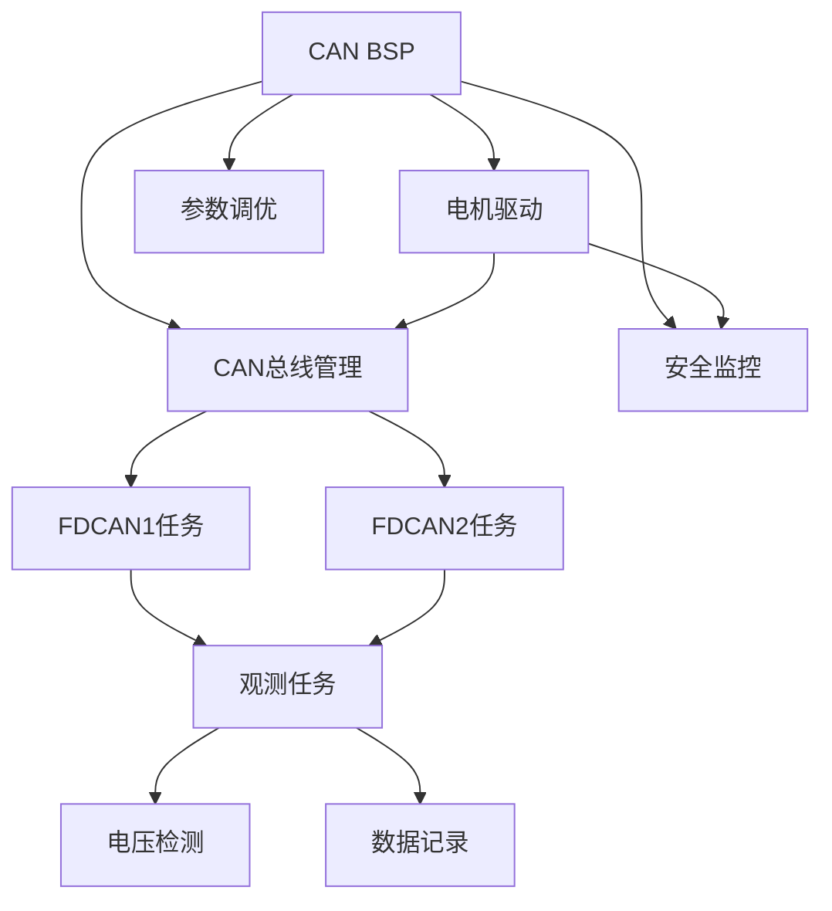

# Ludan Control Board - 开发计划

## 📋 版本规划概述

本项目采用分版本迭代开发策略，从最小可行产品（MVP）开始，逐步增强功能和完善系统。

### 版本划分策略

- **版本1.0 (MVP)**: 基础CAN通信、多电机控制
  - 目标：实现基本的双CAN总线电机控制功能
  - 核心功能：CAN通信、电机驱动、基本控制循环
  
- **版本2.0 (增强)**: 参数调优、数据记录
  - 目标：增强系统功能和可维护性
  - 核心功能：在线调参、数据记录、算法优化
  
- **版本3.0 (扩展)**: 安全机制、高级功能
  - 目标：完善安全保护和扩展功能
  - 核心功能：安全监控、故障诊断、高级控制

### 开发原则

1. **依赖关系优先**: 按照模块依赖关系确定开发顺序
2. **并行开发**: 独立模块可以并行开发
3. **测试驱动**: 每个任务包含测试单元编写阶段
4. **文档同步**: 开发过程中同步更新文档

---

## 🧪 测试策略

### 测试层次

**单元测试**:
- 测试框架: Unity (C语言单元测试框架)
- 覆盖率要求: 关键函数 ≥80%
- 测试环境: PC端模拟（使用Mock HAL库）
- 测试内容: 函数功能、边界条件、错误处理

**集成测试**:
- 测试环境: 硬件在环（HIL）
- 测试内容: 模块间接口、数据流、时序
- 测试工具: CAN分析仪、示波器、逻辑分析仪

**系统测试**:
- 测试环境: 完整硬件系统
- 测试内容: 端到端功能、性能、稳定性
- 测试时长: 连续运行24小时

### 测试用例模板

```c
// 单元测试用例模板
void test_function_name_normal_case(void) {
    // 准备测试数据
    // 执行函数
    // 验证结果
    TEST_ASSERT_EQUAL(expected, actual);
}

void test_function_name_boundary_case(void) {
    // 测试边界条件
}

void test_function_name_error_case(void) {
    // 测试错误处理
}
```

### 测试环境要求

| 测试类型 | 硬件要求 | 软件要求 | 工具要求 |
|---------|---------|---------|---------|
| 单元测试 | PC | Unity框架 | 编译器 |
| 集成测试 | 开发板 | HAL库 | CAN分析仪 |
| 系统测试 | 完整系统 | 所有模块 | 示波器、逻辑分析仪 |

---

## ⚠️ 风险评估

### 技术风险

| 风险项 | 风险等级 | 影响 | 应对措施 |
|--------|---------|------|---------|
| CAN通信不稳定 | 中 | 电机控制失效 | 增加重试机制、超时检测 |
| 实时性无法保证 | 高 | 控制性能下降 | 优化关键路径、调整任务优先级 |
| 内存溢出 | 中 | 系统崩溃 | 内存使用监控、堆栈检查 |
| 电机使能失败 | 中 | 部分电机无法工作 | 增加重试次数、故障上报 |
| Flash写入失败 | 低 | 参数无法保存 | 增加校验、备份机制 |

### 进度风险

| 风险项 | 风险等级 | 影响 | 应对措施 |
|--------|---------|------|---------|
| 任务依赖阻塞 | 中 | 开发延期 | 提前识别依赖、并行开发独立模块 |
| 测试时间不足 | 中 | 质量问题 | 测试与开发并行、自动化测试 |
| 硬件问题 | 高 | 开发停滞 | 准备备用硬件、模拟器开发 |

### 应对策略

**风险缓解**:
- 提前识别高风险任务
- 准备备选技术方案
- 建立问题跟踪机制

**风险监控**:
- 每周风险评估会议
- 关键节点检查
- 问题及时上报

---

## 🎯 里程碑定义

### 版本1.0里程碑

**里程碑1.1 - 基础CAN通信完成** (TASK001完成)
- 验收标准:
  - CAN配置函数通过单元测试
  - CAN发送/接收功能正常
  - 通过集成测试（与CAN分析仪通信）

**里程碑1.2 - 电机驱动完成** (TASK002完成)
- 验收标准:
  - 支持所有7种电机型号
  - 编码/解码精度满足要求
  - 通过单元测试和集成测试

**里程碑1.3 - 多电机控制完成** (TASK004, TASK005完成)
- 验收标准:
  - 双CAN总线同时工作
  - 32个电机同时控制
  - 控制周期稳定在1ms

**里程碑1.4 - MVP版本完成** (所有1.0任务完成)
- 验收标准:
  - 所有功能测试通过
  - 性能指标满足要求
  - 文档完整
  - 连续运行24小时无故障

### 版本2.0里程碑

**里程碑2.1 - 参数调优完成** (TASK008完成)
- 验收标准:
  - 支持在线调参
  - 参数保存/加载功能正常
  - 通过功能测试

**里程碑2.2 - 数据记录完成** (TASK009完成)
- 验收标准:
  - 数据记录功能正常
  - 数据格式正确
  - 通过功能测试

### 版本3.0里程碑

**里程碑3.1 - 安全机制完成** (TASK010完成)
- 验收标准:
  - 所有安全功能正常
  - 故障检测准确
  - 通过安全测试

### 交付物清单

**版本1.0交付物**:
- [ ] 源代码（完整功能）
- [ ] 编译后的固件（.bin, .hex）
- [ ] 技术文档（README.md）
- [ ] 开发文档（DEV_PLAN.md）
- [ ] 测试报告
- [ ] 用户手册（可选）

---

## ✅ 代码审查清单

### 代码质量检查

- [ ] **命名规范**: 函数、变量命名符合规范（下划线命名法）
- [ ] **注释完整**: 所有公共函数有Doxygen注释
- [ ] **函数长度**: 单个函数不超过100行
- [ ] **圈复杂度**: 函数圈复杂度 ≤10
- [ ] **代码重复**: 无重复代码（DRY原则）
- [ ] **魔数消除**: 所有常量使用宏定义或枚举

### 安全性检查

- [ ] **缓冲区溢出**: 所有数组访问有边界检查
- [ ] **空指针检查**: 指针使用前检查NULL
- [ ] **资源泄漏**: 动态分配的内存正确释放
- [ ] **整数溢出**: 整数运算检查溢出
- [ ] **除零检查**: 除法运算检查除数为0

### 性能检查

- [ ] **算法复杂度**: 关键路径算法复杂度合理
- [ ] **内存使用**: 内存使用在限制范围内
- [ ] **实时性**: 关键函数执行时间满足要求
- [ ] **优化**: 关键路径代码已优化

### 可维护性检查

- [ ] **模块化**: 代码模块化程度高
- [ ] **耦合度**: 模块间耦合度低
- [ ] **可测试性**: 函数易于单元测试
- [ ] **文档**: 代码文档完整

---

## 🚀 版本1.0 - MVP (最小可行产品)

### 版本目标

实现基础的CAN总线通信和多电机控制功能，能够通过双CAN总线控制最多32个电机（每条总线16个）。

### 任务列表

#### TASK001 - CAN总线BSP模块

**任务名称**: CAN总线板级支持包  
**所属版本**: 1.0  
**状态**: 计划中  
**依赖任务**: 无  
**功能模块路径**: `User/Bsp/can_bsp.c`, `User/Bsp/can_bsp.h`

**功能描述**:  
实现CAN总线的底层配置、数据发送和接收功能，为上层应用提供统一的CAN通信接口。

**子任务清单**:

1. **FDCAN1_Config()** - FDCAN1总线配置
   - 功能：配置FDCAN1的过滤器、启动CAN、激活接收中断
   - 输入：无
   - 输出：无（通过Error_Handler处理错误）
   - AI提示词：见下方

2. **FDCAN2_Config()** - FDCAN2总线配置
   - 功能：配置FDCAN2的过滤器、启动CAN、激活接收中断
   - 输入：无
   - 输出：无（通过Error_Handler处理错误）
   - AI提示词：见下方

3. **canx_send_data()** - CAN数据发送
   - 功能：通过指定CAN总线发送数据，支持重试机制
   - 输入：CAN句柄、CAN ID、数据缓冲区、数据长度
   - 输出：0成功，1失败
   - AI提示词：见下方

**AI提示词模板**:

```
你是一个STM32嵌入式系统开发专家。请实现以下函数：

**上下文信息**:
- 项目路径: User/Bsp/can_bsp.c, User/Bsp/can_bsp.h
- 依赖模块: HAL库 (fdcan.h), FreeRTOS (cmsis_os2.h)
- 相关文件: 
  - Core/Inc/fdcan.h (HAL FDCAN定义)
  - User/Bsp/can_bsp.h (接口定义)

**函数要求**:
函数名: [函数名]
函数签名: [函数签名]
功能描述: [功能描述]

**技术要求**:
1. 使用STM32 HAL库的FDCAN接口
2. 支持FreeRTOS环境（使用osDelay）和非RTOS环境（使用HAL_Delay）
3. 错误处理：调用Error_Handler()处理HAL错误
4. CAN配置：
   - 标准ID范围：0x11-0x1F
   - 支持CAN FD模式，BRS使能
   - 数据长度：支持8/12/16/20/24/48/64字节

**代码风格要求**:
1. 函数命名：使用下划线命名法，全小写
2. 变量命名：使用下划线命名法，全小写
3. 注释：使用Doxygen风格，包含@brief, @param, @retval
4. 缩进：使用4个空格
5. 大括号：K&R风格（开括号不换行）

**错误处理要求**:
1. 所有HAL函数调用必须检查返回值
2. HAL_OK以外的返回值调用Error_Handler()
3. 发送失败返回1，成功返回0
4. 发送重试最多100次，每次延迟1ms

**测试要求**:
1. 单元测试：测试正常发送、FIFO满、超时情况
2. 集成测试：与真实CAN总线通信测试
3. 性能测试：测试发送延迟和吞吐量

**验收标准**:
1. 函数编译通过，无警告
2. 通过单元测试
3. 通过集成测试
4. 代码符合风格要求
5. 错误处理完整

请实现该函数，并提供完整的代码。
```

---

#### TASK002 - 电机驱动模块

**任务名称**: DM电机驱动  
**所属版本**: 1.0  
**状态**: 计划中  
**依赖任务**: TASK001  
**功能模块路径**: `User/Devices/DM_Motor/motor_config.c`, `User/Devices/DM_Motor/motor_config.h`

**功能描述**:  
实现DM系列电机的驱动功能，包括电机初始化、使能/禁用、控制命令发送、反馈数据解析。

**子任务清单**:

1. **joint_motor_init()** - 关节电机初始化
2. **enable_motor_mode()** - 使能电机模式
3. **disable_motor_mode()** - 禁用电机模式
4. **mit_ctrl()** - MIT模式控制（DM4310）
5. **mit_ctrl2()** - MIT模式控制（DM4340）
6. **mit_ctrl3()** - MIT模式控制（DM6006）
7. **mit_ctrl4()** - MIT模式控制（DM8006）
8. **mit_ctrl5()** - MIT模式控制（DM3507）
9. **dm4310_fbdata()** - DM4310反馈解析
10. **dm4340_fbdata()** - DM4340反馈解析
11. **dm6006_fbdata()** - DM6006反馈解析
12. **dm8006_fbdata()** - DM8006反馈解析
13. **dm3507_fbdata()** - DM3507反馈解析
14. **dm10010l_fbdata()** - DM10010L反馈解析
15. **dm6248p_fbdata()** - DM6248P反馈解析
16. **float_to_uint()** - 浮点数转整数（编码）
17. **uint_to_float()** - 整数转浮点数（解码）

**AI提示词模板**:

```
你是一个STM32嵌入式系统开发专家。请实现以下函数：

**上下文信息**:
- 项目路径: User/Devices/DM_Motor/motor_config.c, motor_config.h
- 依赖模块: CAN BSP (can_bsp.h), 工具库 (user_lib.h)
- 相关文件:
  - User/Bsp/can_bsp.h (CAN发送接口)
  - User/Devices/DM_Motor/motor_config.h (数据结构定义)

**函数要求**:
函数名: [函数名]
函数签名: [函数签名]
功能描述: [功能描述]

**技术要求**:
1. 支持7种DM电机型号（4310, 4340, 6006, 8006, 3507, 10010L, 6248P）
2. 每种电机有不同的参数范围（位置、速度、力矩、刚度、阻尼）
3. 数据编码：使用float_to_uint将浮点数编码为整数
4. 数据解码：使用uint_to_float将整数解码为浮点数
5. CAN通信：使用canx_send_data发送控制命令

**代码风格要求**:
1. 函数命名：使用下划线命名法
2. 注释：Doxygen风格，详细说明参数范围
3. 数据验证：检查参数是否在有效范围内
4. 错误处理：参数无效时使用默认值或返回错误

**错误处理要求**:
1. 检查CAN发送返回值
2. 验证参数范围（使用motor_config.h中的MIN/MAX宏）
3. 反馈数据长度验证（必须为8字节）
4. 状态码检查（state字段）

**测试要求**:
1. 单元测试：测试参数编码/解码精度
2. 集成测试：与真实电机通信测试
3. 边界测试：测试参数边界值

**验收标准**:
1. 支持所有7种电机型号
2. 编码/解码精度满足要求
3. 通过所有测试
4. 代码符合风格要求

请实现该函数。
```

---

#### TASK003 - CAN总线管理模块

**任务名称**: CAN总线管理  
**所属版本**: 1.0  
**状态**: 计划中  
**依赖任务**: TASK001, TASK002  
**功能模块路径**: `User/App/fdcan_bus.c`, `User/App/fdcan_bus.h`

**功能描述**:  
管理CAN总线对象，包括总线初始化、电机数组管理、启动标志控制。

**子任务清单**:

1. **fdcan_bus_t结构体定义** - CAN总线管理结构
2. **全局总线对象定义** - fdcan1_bus, fdcan2_bus

**AI提示词**:

```
实现CAN总线管理模块的数据结构定义。

**要求**:
1. 定义fdcan_bus_t结构体，包含：
   - FDCAN句柄指针
   - 电机数组（最多16个）
   - 电机数量
   - 启动标志

2. 定义全局总线对象：
   - fdcan1_bus（绑定hfdcan1）
   - fdcan2_bus（绑定hfdcan2）

3. 初始化电机数量为15（可根据实际调整）

请提供完整的头文件和源文件实现。
```

---

#### TASK004 - FDCAN1任务模块

**任务名称**: FDCAN1控制任务  
**所属版本**: 1.0  
**状态**: 计划中  
**依赖任务**: TASK001, TASK002, TASK003  
**功能模块路径**: `User/App/fdcan1_task.c`, `User/App/fdcan1_task.h`

**功能描述**:  
实现FDCAN1总线的电机控制任务，包括总线初始化、电机使能、控制循环。

**子任务清单**:

1. **fdcan1_init()** - FDCAN1总线初始化
2. **fdcan1_task_()** - FDCAN1任务主循环

**AI提示词**:

```
实现FDCAN1控制任务。

**要求**:
1. fdcan1_init():
   - 初始化所有电机参数
   - 逐个使能电机（最多重试20次，每次间隔25ms）
   - 设置start_flag

2. fdcan1_task_():
   - 延迟500ms等待系统稳定
   - 调用fdcan1_init()
   - 初始化电机反馈数据结构
   - 循环发送控制命令（周期1ms）

**注意事项**:
- 使用FreeRTOS的osDelay
- 检查电机使能状态
- 控制周期由CHASSR_TIME变量控制

请实现完整代码。
```

---

#### TASK005 - FDCAN2任务模块

**任务名称**: FDCAN2控制任务  
**所属版本**: 1.0  
**状态**: 计划中  
**依赖任务**: TASK001, TASK002, TASK003  
**功能模块路径**: `User/App/fdcan2_task.c`, `User/App/fdcan2_task.h`

**功能描述**:  
实现FDCAN2总线的电机控制任务，功能与FDCAN1类似。

**子任务清单**:

1. **fdcan2_init()** - FDCAN2总线初始化
2. **fdcan2_task_()** - FDCAN2任务主循环

**AI提示词**: 参考TASK004，将FDCAN1改为FDCAN2

---

#### TASK006 - 数据观测任务模块

**任务名称**: 数据观测与发送  
**所属版本**: 1.0  
**状态**: 计划中  
**依赖任务**: TASK003, TASK004, TASK005  
**功能模块路径**: `User/App/observe_task.c`, `User/App/observe_task.h`

**功能描述**:  
收集所有电机数据，打包后通过USB CDC或串口发送。

**子任务清单**:

1. **observe_task_()** - 观测任务主循环

**AI提示词**:

```
实现数据观测任务。

**要求**:
1. 收集FDCAN1和FDCAN2总线上所有电机数据
2. 数据打包格式：
   - 帧头：FRAME_HEADER
   - 每电机5字节：位置(2B) + 速度(1.5B) + 力矩(1.5B)
   - 校验和：最后1字节
3. 通过USB CDC发送（CDC_Transmit_HS）
4. 周期：1ms（OBSERVE_TIME=1时640Hz）

**数据压缩**:
- 速度：12位，压缩到1.5字节
- 力矩：12位，压缩到1.5字节

请实现完整代码。
```

---

#### TASK007 - 电压检测任务模块

**任务名称**: 电压检测与保护  
**所属版本**: 1.0  
**状态**: 计划中  
**依赖任务**: 无  
**功能模块路径**: `User/App/vbus_check.c`, `User/App/vbus_check.h`

**功能描述**:  
实时监测系统电压，提供低电压报警和保护功能。

**子任务清单**:

1. **VBUS_Check_task()** - 电压检测任务主循环

**AI提示词**:

```
实现电压检测任务。

**要求**:
1. ADC校准和DMA循环采集
2. 电压计算：vbus = (adc_val + calibration) * 3.3 / 65535 * 11.0
3. 电压判断：
   - 6.0V < vbus < 22.6V: 蜂鸣器报警
   - 6.0V < vbus < 22.2V: 低电压保护（关闭部分电源）
4. 周期：10ms

**关键参数**:
- calibration_value: 378
- vbus_threhold_disable: 22.2V
- vbus_threhold_call: 22.6V

请实现完整代码。
```

---

## 🔧 版本2.0 - 增强功能

### 版本目标

增强系统功能，实现参数在线调优、数据记录、算法优化等功能。

### 任务列表

#### TASK008 - 参数在线调优模块

**任务名称**: 参数在线调优  
**所属版本**: 2.0  
**状态**: 计划中  
**依赖任务**: TASK001-TASK007  
**功能模块路径**: `User/App/param_tuning.c`, `User/App/param_tuning.h`

**功能描述**:  
实现通过USB/串口实时调整PID等控制参数的功能。

**子任务清单**:

1. **param_tuning_init()** - 参数调优初始化
2. **param_tuning_parse()** - 解析调参命令
3. **param_tuning_set_pid()** - 设置PID参数
4. **param_tuning_save()** - 保存参数到Flash
5. **param_tuning_load()** - 从Flash加载参数

**AI提示词模板**:

```
实现参数在线调优功能。

**要求**:
1. 支持通过USB CDC接收调参命令
2. 命令格式：SET_PID_KP [motor_id] [value]
3. 支持参数：Kp, Ki, Kd, 位置、速度、力矩目标值
4. 可选：参数保存到Flash（需要实现Flash读写）

**协议设计**:
- 命令头：固定字符串（如"SET_"）
- 参数ID：参数类型标识
- 参数值：浮点数
- 校验和：可选

**错误处理**:
- 命令格式错误
- 参数范围检查
- Flash写入失败

请实现完整功能。
```

---

#### TASK009 - 数据记录模块

**任务名称**: 数据记录功能  
**所属版本**: 2.0  
**状态**: 计划中  
**依赖任务**: TASK006  
**功能模块路径**: `User/App/data_logger.c`, `User/App/data_logger.h`

**功能描述**:  
实现数据记录功能，支持触发式记录和数据回放。

**子任务清单**:

1. **data_logger_init()** - 数据记录初始化
2. **data_logger_start()** - 开始记录
3. **data_logger_stop()** - 停止记录
4. **data_logger_write()** - 写入数据
5. **data_logger_read()** - 读取数据

**AI提示词**: 

```
实现数据记录功能。

**要求**:
1. 支持SD卡或Flash存储
2. 数据格式：CSV或二进制
3. 触发方式：按键、命令、定时
4. 数据内容：所有电机状态、控制命令、时间戳

**存储考虑**:
- Flash：容量有限，循环覆盖
- SD卡：需要SPI接口和文件系统（FatFS）

请根据硬件资源选择实现方案。
```

---

## 🛡️ 版本3.0 - 安全机制

### 版本目标

实现完善的安全保护机制，包括看门狗、故障检测、急停等功能。

### 任务列表

#### TASK010 - 安全监控模块

**任务名称**: 安全监控系统  
**所属版本**: 3.0  
**状态**: 计划中  
**依赖任务**: TASK001-TASK007  
**功能模块路径**: `User/App/safety_monitor.c`, `User/App/safety_monitor.h`

**功能描述**:  
实现系统安全监控，包括看门狗、温度监控、堵转检测等。

**子任务清单**:

1. **safety_monitor_init()** - 安全监控初始化
2. **safety_monitor_task()** - 安全监控任务
3. **watchdog_feed()** - 喂狗函数
4. **motor_stall_detect()** - 电机堵转检测
5. **temperature_monitor()** - 温度监控
6. **emergency_stop()** - 紧急停止

**AI提示词**:

```
实现安全监控系统。

**要求**:
1. 看门狗：独立看门狗（IWDG），超时时间可配置
2. 电机堵转检测：检测速度异常、电流异常
3. 温度监控：电机温度、MCU温度
4. 紧急停止：检测到危险时立即停止所有电机

**安全策略**:
- 看门狗超时：系统复位
- 堵转检测：禁用对应电机
- 温度过高：降低功率或停止
- 紧急停止：所有电机立即禁用

请实现完整的安全监控功能。
```

---

## 📝 AI提示词模板

### 通用模板

```
你是一个STM32嵌入式系统开发专家。请实现以下功能：

**项目背景**:
- 项目名称: Ludan Control Board
- 目标芯片: STM32H723VGT6 (Cortex-M7, 480MHz)
- RTOS: FreeRTOS (CMSIS-RTOS V2)
- 开发环境: CMake + arm-none-eabi-gcc

**任务要求**:
[具体任务描述]

**上下文信息**:
- 相关文件: [文件路径列表]
- 依赖模块: [模块列表]
- 接口定义: [接口说明]

**技术要求**:
1. [技术点1]
2. [技术点2]
3. ...

**代码风格要求**:
1. 命名规范: 下划线命名法，全小写
2. 注释风格: Doxygen格式
3. 缩进: 4个空格
4. 大括号: K&R风格

**错误处理要求**:
1. 所有HAL调用检查返回值
2. 使用统一的错误码
3. 错误日志记录
4. 错误恢复策略

**测试要求**:
1. 单元测试: [测试内容]
2. 集成测试: [测试内容]
3. 性能测试: [测试内容]

**验收标准**:
1. 功能完整
2. 通过所有测试
3. 代码符合规范
4. 文档完整

请提供完整的实现代码。
```

---

## 🔗 任务依赖关系图



## 📊 并行开发计划

### 可并行开发的任务组

**第一组（基础层）**:
- TASK001 (CAN BSP) - 可独立开发

**第二组（驱动层）**:
- TASK002 (电机驱动) - 依赖TASK001
- TASK007 (电压检测) - 可独立开发

**第三组（应用层）**:
- TASK004 (FDCAN1任务) - 依赖TASK001, TASK002, TASK003
- TASK005 (FDCAN2任务) - 依赖TASK001, TASK002, TASK003
  - 注：TASK004和TASK005可以并行开发（代码结构相似）

**第四组（增强功能）**:
- TASK008 (参数调优) - 依赖基础功能
- TASK009 (数据记录) - 依赖TASK006

**第五组（安全功能）**:
- TASK010 (安全监控) - 依赖基础功能

---

## 📅 开发时间估算

| 版本 | 任务数 | 预计时间 | 说明 |
|------|--------|---------|------|
| 1.0 | 7个任务 | 4-6周 | MVP版本 |
| 2.0 | 2个任务 | 2-3周 | 增强功能 |
| 3.0 | 1个任务 | 2-3周 | 安全机制 |
| **总计** | **10个任务** | **8-12周** | 完整开发周期 |

---

**最后更新**: 2025-01-XX

