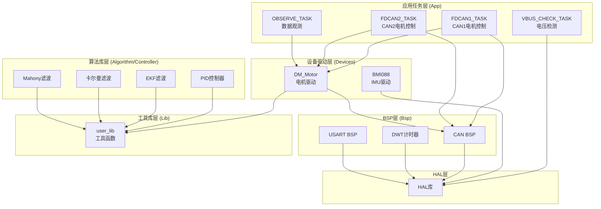
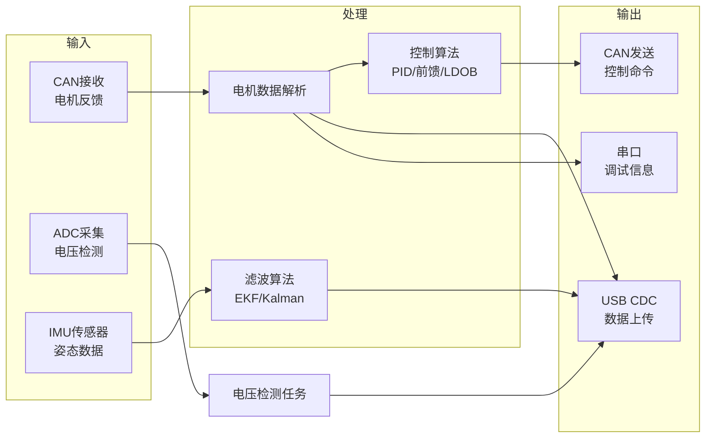
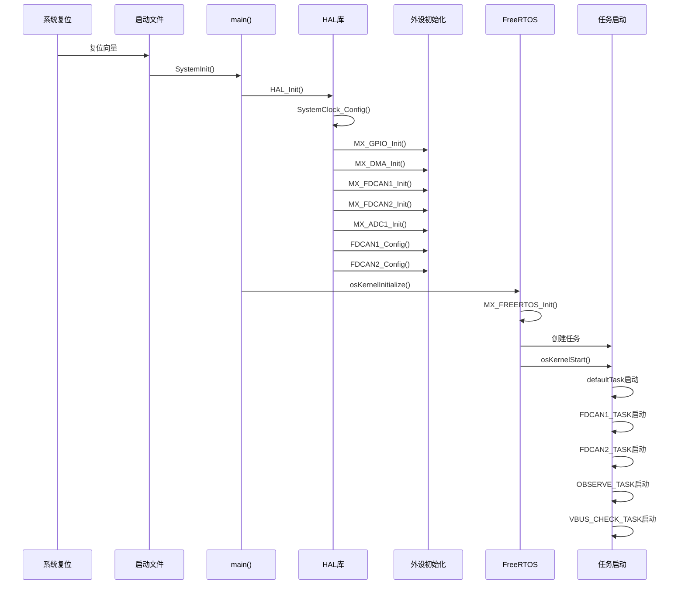
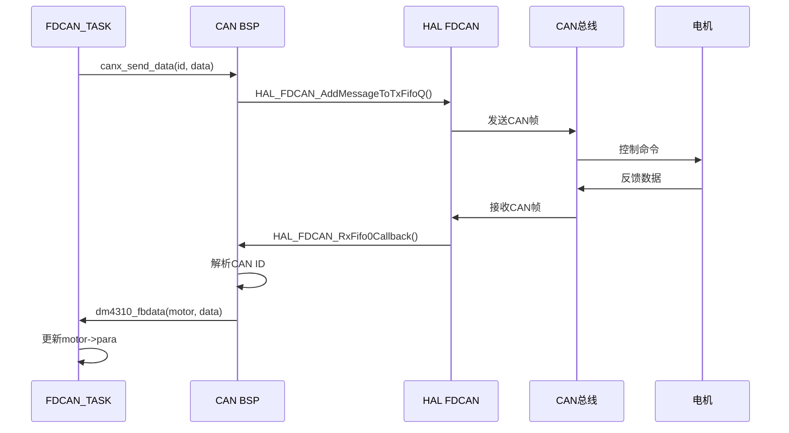
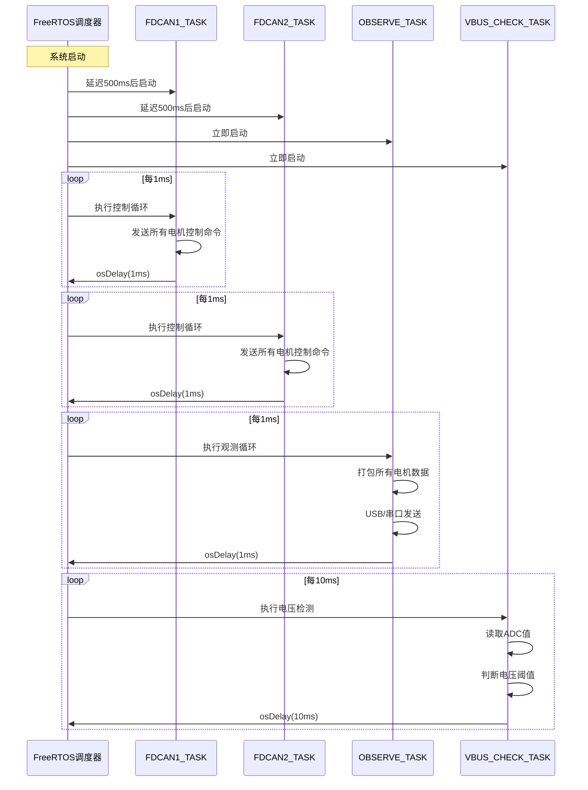
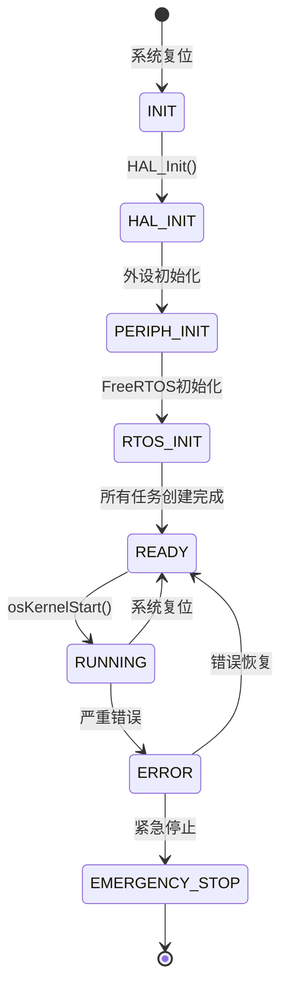
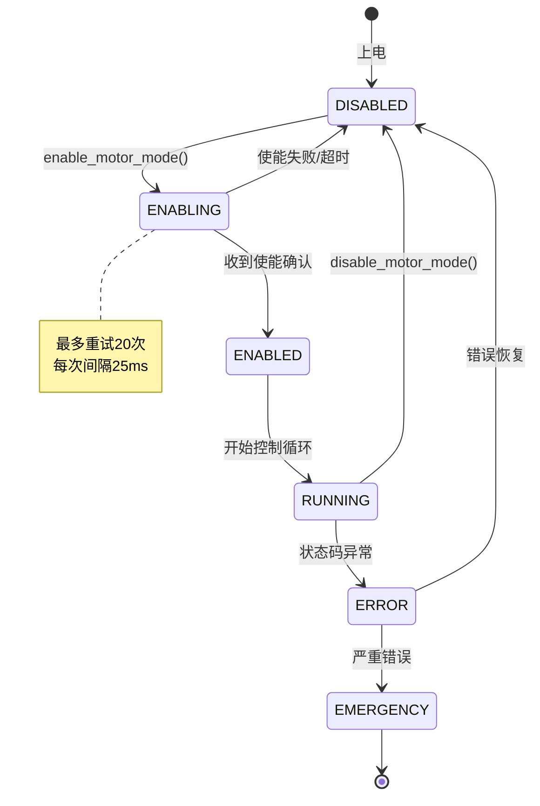
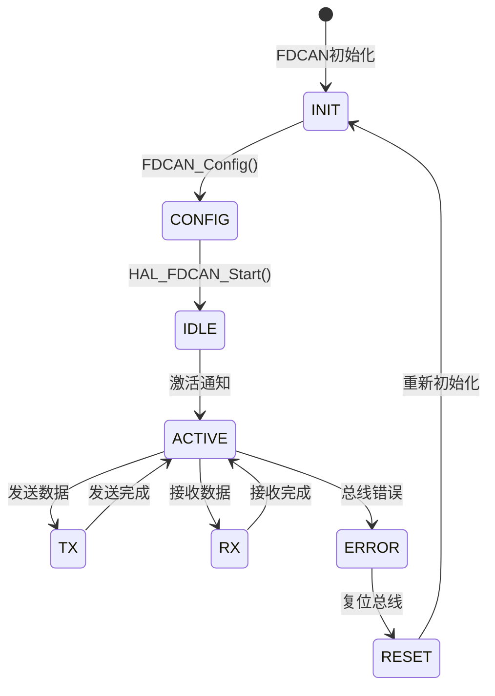

# Ludan Control Board - STM32H7 机器人控制板

## 📋 项目概述

本项目是一个基于STM32H723VGT6的高性能机器人控制板固件，专为多关节机器人系统设计。支持通过CAN总线控制多个电机，集成IMU传感器进行姿态感知，并提供了丰富的控制算法库。

**主要特性：**
- 支持双CAN总线，每条总线最多控制16个电机
- 集成BMI088 IMU传感器（加速度计+陀螺仪）
- 多种控制算法（PID、前馈、扰动观测器等）
- FreeRTOS实时操作系统
- USB CDC调试接口
- 实时电压监测与保护

---

## 🔧 硬件平台

### 主控芯片
- **型号**: STM32H723VGT6
- **内核**: ARM Cortex-M7
- **主频**: 480MHz
- **浮点单元**: FPU (fpv5-d16, hard float ABI)
- **Flash**: 1MB
- **RAM**: 
  - DTCM: 128KB
  - AXI SRAM: 320KB
  - SRAM1/2/3/4: 128KB
  - SRAM D2: 32KB
  - SRAM D3: 16KB

### 外部时钟
- **HSE**: 25MHz（外部高速晶振）
- **LSE**: 32.768KHz（外部低速晶振，用于RTC）

### 外设配置

#### CAN总线
- **FDCAN1**: 1Mbps，FD模式，BRS使能，用于电机控制总线1
- **FDCAN2**: 1Mbps，FD模式，BRS使能，用于电机控制总线2
- **FDCAN3**: 1Mbps，FD模式，BRS使能，预留扩展

#### 通信接口
- **USB OTG HS**: USB Device模式，CDC类，用于调试和数据传输
- **USART1**: 串口通信，波特率可配置，支持DMA
- **SPI2**: 用于BMI088 IMU传感器通信，支持DMA

#### 其他外设
- **ADC1**: 2通道，DMA循环模式
  - 通道0: ADC1_INP19 (PA5) - 电压检测
  - 通道1: ADC1_INP4 (PC4) - 预留
- **TIM3**: PWM输出，通道4 (PB1)
- **TIM12**: PWM输出，通道2 (PB15)
- **GPIO**: 
  - 电源控制输出
  - 蜂鸣器控制
  - 传感器片选信号（ACC_CS, GYRO_CS）
  - 传感器中断信号（ACC_INT, GYRO_INT）

---

## 💻 软件架构

### 构建系统
- **主构建系统**: CMake 3.22+
- **备用构建系统**: Makefile
- **编译器**: arm-none-eabi-gcc
- **C标准**: C11
- **C++标准**: C++17

### 实时操作系统
- **RTOS**: FreeRTOS (CMSIS-RTOS V2接口)
- **堆大小**: 30KB
- **FPU支持**: 已启用
- **任务调度**: 抢占式调度

### 任务结构

| 任务名称 | 优先级 | 堆栈大小 | 功能描述 |
|---------|--------|---------|---------|
| defaultTask | Normal | 512×4 bytes | USB设备初始化 |
| FDCAN1_TASK | High | 512×4 bytes | CAN1总线电机控制 |
| FDCAN2_TASK | High | 512×4 bytes | CAN2总线电机控制 |
| OBSERVE_TASK | High | 512×4 bytes | 数据观测与发送 |
| VBUS_CHECK_TASK | Normal | 512×4 bytes | 电压检测与保护 |

---

## 🏗️ 系统架构设计

### 模块关系图



### 数据流图



### 模块依赖关系

| 模块 | 依赖模块 | 说明 |
|------|---------|------|
| FDCAN1_TASK | CAN_BSP, DM_Motor, user_lib | CAN1任务依赖CAN BSP和电机驱动 |
| FDCAN2_TASK | CAN_BSP, DM_Motor, user_lib | CAN2任务依赖CAN BSP和电机驱动 |
| OBSERVE_TASK | DM_Motor, USB_DEVICE | 观测任务依赖电机数据和USB |
| VBUS_CHECK_TASK | HAL_ADC | 电压检测依赖HAL ADC |
| DM_Motor | CAN_BSP, user_lib | 电机驱动依赖CAN BSP |
| BMI088 | HAL_SPI | IMU驱动依赖HAL SPI |
| Controller | user_lib, arm_math | 控制器依赖工具库和数学库 |
| CAN_BSP | HAL_FDCAN | CAN BSP依赖HAL FDCAN |

---

## 🏗️ 项目结构

```
ludan_control_board/
├── Core/                          # STM32CubeMX生成的HAL驱动代码
│   ├── Inc/                       # 头文件
│   │   ├── main.h                 # 主头文件，包含GPIO定义
│   │   ├── stm32h7xx_hal_conf.h   # HAL库配置
│   │   ├── FreeRTOSConfig.h       # FreeRTOS配置
│   │   └── ...                    # 其他外设头文件
│   └── Src/                       # 源文件
│       ├── main.c                 # 主程序入口
│       ├── freertos.c             # FreeRTOS任务定义
│       └── ...                    # 其他外设源文件
│
├── Drivers/                       # STM32驱动库
│   ├── CMSIS/                     # CMSIS核心文件
│   └── STM32H7xx_HAL_Driver/      # HAL驱动库
│
├── Middlewares/                   # 中间件
│   ├── ST/                        # ST官方中间件
│   │   └── STM32_USB_Device_Library/  # USB设备库
│   └── Third_Party/               # 第三方库
│       └── FreeRTOS/               # FreeRTOS源码
│
├── USB_DEVICE/                    # USB设备配置
│   ├── App/                       # USB应用层
│   └── Target/                    # USB目标配置
│
├── User/                          # 用户代码
│   ├── App/                       # 应用任务
│   │   ├── fdcan_bus.c/h          # CAN总线管理
│   │   ├── fdcan1_task.c/h        # CAN1任务
│   │   ├── fdcan2_task.c/h        # CAN2任务
│   │   ├── observe_task.c/h       # 观测任务
│   │   └── vbus_check.c/h         # 电压检测任务
│   │
│   ├── Bsp/                       # 板级支持包
│   │   ├── bsp_dwt.c/h            # DWT计时器
│   │   ├── bsp_PWM.c/h            # PWM控制
│   │   ├── bsp_usart1.c/h         # 串口1驱动
│   │   └── can_bsp.c/h            # CAN总线BSP
│   │
│   ├── Controller/                # 控制器算法
│   │   ├── controller.c/h         # 控制器接口
│   │   └── ...                    # PID、前馈等算法
│   │
│   ├── Algorithm/                 # 滤波和估计算法
│   │   ├── EKF/                   # 扩展卡尔曼滤波
│   │   ├── kalman/                # 卡尔曼滤波
│   │   ├── mahony/                # Mahony滤波
│   │   ├── PID/                   # PID算法
│   │   └── VMC/                   # VMC计算
│   │
│   ├── Devices/                   # 设备驱动
│   │   ├── BMI088/                # BMI088 IMU驱动
│   │   └── DM_Motor/              # DM电机驱动
│   │
│   └── Lib/                       # 工具库
│       └── user_lib.c/h           # 通用工具函数
│
├── cmake/                         # CMake配置
│   └── stm32cubemx/               # STM32CubeMX CMake配置
│
├── build/                         # 构建输出目录
│   └── Debug/                     # Debug版本输出
│
├── CMakeLists.txt                 # CMake主配置文件
├── Makefile                       # Makefile构建脚本
├── CMakePresets.json              # CMake预设配置
├── STM32H723XG_FLASH.ld           # 链接脚本
├── startup_stm32h723xx.s          # 启动文件
├── ludan_control_board.ioc        # STM32CubeMX配置文件
├── flash.jlink                    # J-Link烧录脚本
└── loadbin.bat                    # Windows批处理烧录脚本
```

---

## 📐 接口规范

### CAN总线接口

#### CAN总线配置接口

```c
/**
 * @brief 配置FDCAN1总线
 * @note 配置过滤器、启动CAN、激活接收中断
 * @thread_safety 非线程安全，应在初始化阶段调用
 */
void FDCAN1_Config(void);

/**
 * @brief 配置FDCAN2总线
 * @note 配置过滤器、启动CAN、激活接收中断
 * @thread_safety 非线程安全，应在初始化阶段调用
 */
void FDCAN2_Config(void);
```

#### CAN数据发送接口

```c
/**
 * @brief 通过CAN总线发送数据
 * @param hcan CAN句柄指针
 * @param id CAN ID (标准ID: 0x11-0x1F)
 * @param data 数据缓冲区指针
 * @param len 数据长度 (支持8/12/16/20/24/48/64字节)
 * @return 0: 成功, 1: 失败（超时）
 * @note 最多重试100次，每次延迟1ms
 * @thread_safety 线程安全（使用FIFO队列）
 */
uint8_t canx_send_data(FDCAN_HandleTypeDef *hcan, uint16_t id, 
                       uint8_t *data, uint32_t len);
```

### 电机控制接口

#### 电机初始化接口

```c
/**
 * @brief 初始化关节电机
 * @param motor 电机结构体指针
 * @param id 电机ID (1-16)
 * @param mode 控制模式 (MIT_MODE/POS_MODE/SPEED_MODE)
 * @thread_safety 非线程安全，应在任务初始化时调用
 */
void joint_motor_init(Joint_Motor_t *motor, uint16_t id, uint16_t mode);
```

#### 电机使能接口

```c
/**
 * @brief 使能电机进入指定模式
 * @param hcan CAN句柄指针
 * @param motor_id 电机ID (1-16)
 * @param mode_id 模式ID (MIT_MODE/POS_MODE/SPEED_MODE)
 * @note 发送使能命令，等待电机反馈确认
 * @thread_safety 应在CAN任务中调用
 */
void enable_motor_mode(hcan_t *hcan, uint16_t motor_id, uint16_t mode_id);

/**
 * @brief 禁用电机
 * @param hcan CAN句柄指针
 * @param motor_id 电机ID (1-16)
 * @param mode_id 模式ID
 * @thread_safety 应在CAN任务中调用
 */
void disable_motor_mode(hcan_t *hcan, uint16_t motor_id, uint16_t mode_id);
```

#### 电机控制接口

```c
/**
 * @brief MIT模式控制（混合控制）
 * @param hcan CAN句柄指针
 * @param motor_id 电机ID (1-16)
 * @param pos 目标位置 (rad)
 * @param vel 目标速度 (rad/s)
 * @param kp 位置刚度系数
 * @param kd 速度阻尼系数
 * @param torq 目标力矩 (N·m)
 * @note 位置、速度、力矩混合控制
 * @thread_safety 应在CAN任务中调用，1kHz频率
 */
void mit_ctrl(hcan_t *hcan, uint16_t motor_id, float pos, float vel,
              float kp, float kd, float torq);

/**
 * @brief 位置速度控制
 * @param hcan CAN句柄指针
 * @param motor_id 电机ID (1-16)
 * @param pos 目标位置 (rad)
 * @param vel 最大速度限制 (rad/s)
 * @thread_safety 应在CAN任务中调用
 */
void pos_speed_ctrl(hcan_t *hcan, uint16_t motor_id, float pos, float vel);

/**
 * @brief 速度控制
 * @param hcan CAN句柄指针
 * @param motor_id 电机ID (1-16)
 * @param vel 目标速度 (rad/s)
 * @thread_safety 应在CAN任务中调用
 */
void speed_ctrl(hcan_t *hcan, uint16_t motor_id, float vel);
```

#### 电机反馈解析接口

```c
/**
 * @brief 解析DM4310电机反馈数据
 * @param motor 电机结构体指针
 * @param rx_data CAN接收数据缓冲区
 * @param len 数据长度（应为8字节）
 * @note 解析位置、速度、力矩、温度等信息
 * @thread_safety 在CAN接收中断中调用
 */
void dm4310_fbdata(Joint_Motor_t *motor, uint8_t *rx_data, uint32_t len);

// 类似接口：dm4340_fbdata, dm6006_fbdata, dm8006_fbdata, 
//          dm3507_fbdata, dm10010l_fbdata, dm6248p_fbdata
```

### 控制器算法接口

#### PID控制器接口

```c
/**
 * @brief PID控制器初始化
 * @param pid PID结构体指针
 * @param max_out 最大输出限制
 * @param intergral_limit 积分限幅
 * @param deadband 死区
 * @param kp 比例系数
 * @param ki 积分系数
 * @param kd 微分系数
 * @param A 变积分参数A
 * @param B 变积分参数B
 * @param output_lpf_rc 输出低通滤波时间常数
 * @param derivative_lpf_rc 微分低通滤波时间常数
 * @param ols_order 最小二乘法阶数
 * @param improve 改进选项（位标志组合）
 * @thread_safety 非线程安全，应在初始化时调用
 */
void PID_Init(PID_t *pid, float max_out, float intergral_limit, 
              float deadband, float kp, float ki, float kd,
              float A, float B, float output_lpf_rc, 
              float derivative_lpf_rc, uint16_t ols_order, uint8_t improve);

/**
 * @brief PID控制器计算
 * @param pid PID结构体指针
 * @param measure 测量值
 * @param ref 参考值
 * @return 控制输出
 * @note 自动计算时间差，支持多种改进选项
 * @thread_safety 线程安全（每个PID对象独立）
 */
float PID_Calculate(PID_t *pid, float measure, float ref);
```

#### 前馈控制接口

```c
/**
 * @brief 前馈控制器初始化
 * @param ffc 前馈控制器结构体指针
 * @param max_out 最大输出限制
 * @param c 传递函数系数数组 [c0, c1, c2]
 * @param lpf_rc 低通滤波时间常数
 * @param ref_dot_ols_order 参考速度最小二乘法阶数
 * @param ref_ddot_ols_order 参考加速度最小二乘法阶数
 */
void Feedforward_Init(Feedforward_t *ffc, float max_out, float *c,
                      float lpf_rc, uint16_t ref_dot_ols_order,
                      uint16_t ref_ddot_ols_order);

/**
 * @brief 前馈控制器计算
 * @param ffc 前馈控制器结构体指针
 * @param ref 参考值
 * @return 前馈输出
 */
float Feedforward_Calculate(Feedforward_t *ffc, float ref);
```

### 任务接口

#### CAN任务接口

```c
/**
 * @brief FDCAN1总线初始化
 * @param bus CAN总线对象指针
 * @note 初始化所有电机，逐个使能（最多重试20次）
 * @thread_safety 在FDCAN1_TASK中调用
 */
void fdcan1_init(fdcan_bus_t *bus);

/**
 * @brief FDCAN1任务主循环
 * @note 循环发送电机控制命令，周期1ms
 * @thread_safety FreeRTOS任务，优先级High
 */
void fdcan1_task_(void);
```

### IMU驱动接口

#### BMI088初始化接口

```c
/**
 * @brief 初始化BMI088 IMU传感器
 * @param bmi088_SPI SPI句柄指针
 * @param calibrate 是否校准（1:校准, 0:不校准）
 * @return 0:成功, 非0:失败（错误码见BMI088driver.h）
 * @note 校准会读取偏移值并保存
 * @thread_safety 非线程安全，应在初始化时调用
 */
uint8_t BMI088_init(SPI_HandleTypeDef *bmi088_SPI, uint8_t calibrate);
```

#### BMI088数据读取接口

```c
/**
 * @brief 读取BMI088传感器数据
 * @param bmi088 IMU数据结构体指针
 * @note 读取加速度、陀螺仪、温度数据
 * @thread_safety 非线程安全，应在任务中调用
 */
void BMI088_Read(IMU_Data_t *bmi088);
```

#### IMU数据结构

```c
typedef struct {
    float Accel[3];          // 加速度 [m/s²]
    float Gyro[3];            // 角速度 [rad/s]
    float Temperature;        // 温度 [°C]
    float AccelScale;         // 加速度量程
    float GyroOffset[3];      // 陀螺仪偏移
    float AccelOffset[3];    // 加速度偏移
    float gNorm;              // 重力加速度标量
} IMU_Data_t;
```

### 工具库接口

#### DWT计时器接口

```c
/**
 * @brief 初始化DWT计时器
 * @param CPU_Freq_mHz CPU频率（MHz）
 * @note 初始化数据观察点计时器，用于高精度计时
 */
void DWT_Init(uint32_t CPU_Freq_mHz);

/**
 * @brief 获取时间差
 * @param cnt_last 上次计数值指针（自动更新）
 * @return 时间差（秒）
 * @note 自动计算两次调用之间的时间差
 */
float DWT_GetDeltaT(uint32_t *cnt_last);

/**
 * @brief 获取系统时间（微秒）
 * @return 系统运行时间（微秒）
 */
uint64_t DWT_GetTimeline_us(void);
```

#### 数学工具接口

```c
/**
 * @brief 快速开方
 * @param x 输入值
 * @return 平方根
 */
float Sqrt(float x);

/**
 * @brief 限幅函数
 * @param Value 输入值
 * @param minValue 最小值
 * @param maxValue 最大值
 * @return 限幅后的值
 */
float float_constrain(float Value, float minValue, float maxValue);

/**
 * @brief 角度格式化（-π到π）
 * @param Ang 输入角度（弧度）
 * @return 格式化后的角度
 */
float rad_format(float Ang);
```

#### 最小二乘法接口

```c
/**
 * @brief 初始化最小二乘法
 * @param OLS 最小二乘法结构体指针
 * @param order 阶数
 * @note 用于信号微分和平滑
 */
void OLS_Init(Ordinary_Least_Squares_t *OLS, uint16_t order);

/**
 * @brief 更新最小二乘法并计算微分
 * @param OLS 最小二乘法结构体指针
 * @param deltax 时间间隔
 * @param y 新数据点
 * @return 微分值
 */
float OLS_Derivative(Ordinary_Least_Squares_t *OLS, float deltax, float y);
```

### 数据结构定义

#### CAN总线管理结构

```c
typedef struct {
    FDCAN_HandleTypeDef *hfdcan;        // CAN句柄
    Joint_Motor_t motor[MAX_MOTORS_PER_BUS];  // 电机数组
    uint8_t motor_count;                // 电机数量
    uint8_t start_flag;                  // 启动标志
} fdcan_bus_t;
```

#### 电机反馈参数结构

```c
typedef struct {
    uint16_t id;                         // 电机ID
    uint16_t state;                      // 状态码
    uint16_t enabled;                    // 使能标志
    
    // 原始整数数据
    int p_int, v_int, t_int;            // 位置、速度、力矩（整数）
    int kp_int, kd_int;                  // 刚度、阻尼（整数）
    
    // 浮点数据
    float pos, vel, tor;                 // 位置、速度、力矩（浮点）
    float kp, kd;                        // 刚度、阻尼（浮点）
    
    // 温度
    float Tmos, Tcoil;                   // MOS管温度、线圈温度
    
    // 测试/设置参数
    float pos_set, vel_set, tor_set;     // 目标位置、速度、力矩
    float kp_test, kd_test;              // 测试刚度、阻尼
} motor_fbpara_t;
```

#### 电机结构

```c
typedef struct {
    uint16_t mode;                       // 控制模式
    motor_fbpara_t para;                 // 反馈参数
} Joint_Motor_t;
```

---

## 📡 通信协议详细定义

### CAN总线协议

#### CAN帧格式

**标准帧格式**:
```
[SOF][ID(11bit)][RTR][IDE][r0][DLC(4bit)][Data(0-8字节)][CRC][ACK][EOF]
```

**本项目使用的CAN帧**:
- **帧类型**: 标准数据帧
- **ID范围**: 0x11 - 0x1F (17-31)
- **ID分配规则**:
  - 0x11-0x1E: 电机反馈ID（对应电机ID 1-14）
  - 0x1F: 特殊命令ID
  - 0x200 + motor_id: 电机控制命令ID（MIT模式）
  - 0x100 + motor_id: 电机使能/禁用命令ID

#### CAN数据编码规则

**电机控制命令格式（MIT模式）**:
```
字节0-1: 位置 (16位，有符号整数)
字节2-3: 速度 (12位，有符号整数，压缩编码)
字节4-5: 力矩 (12位，有符号整数，压缩编码)
字节6-7: Kp (12位，无符号整数，压缩编码)
字节8-9: Kd (12位，无符号整数，压缩编码)
```

**电机反馈数据格式**:
```
字节0: [状态码(4bit)][电机ID(4bit)]
字节1-2: 位置 (16位，有符号整数)
字节3-4: 速度 (12位，有符号整数，压缩编码)
字节5: 力矩高4位 | 速度低4位
字节6: 力矩低8位
字节7: 温度 (MOS管温度)
字节8: 温度 (线圈温度)
```

**数据压缩编码规则**:
```c
// 速度/力矩压缩编码（12位数据压缩到1.5字节）
// 字节3: [速度高8位]
// 字节4: [速度低4位 | 力矩高4位]
// 字节5: [力矩低8位]

uint8_t byte3 = (v_int >> 4) & 0xFF;           // 速度高8位
uint8_t byte4 = ((v_int & 0x0F) << 4) | ((t_int >> 8) & 0x0F);  // 速度低4位 | 力矩高4位
uint8_t byte5 = t_int & 0xFF;                  // 力矩低8位
```

#### CAN通信时序要求

- **控制命令发送周期**: 1ms（1kHz）
- **反馈数据接收**: 异步（中断触发）
- **超时检测**: 连续3个周期未收到反馈视为通信故障
- **重试机制**: 发送失败最多重试100次，每次延迟1ms

### USB CDC协议

#### 数据帧格式

**上行数据帧（设备→主机）**:
```
[帧头(1B)][电机1数据(5B)][电机2数据(5B)]...[电机N数据(5B)][校验和(1B)]
总长度: 152字节
```

**帧结构**:
- **帧头**: 0x7B (FRAME_HEADER)
- **电机数据**: 每电机5字节
  - 字节0-1: 位置 (16位，大端序)
  - 字节2: 速度高8位
  - 字节3: [速度低4位 | 力矩高4位]
  - 字节4: 力矩低8位
- **校验和**: 累加和校验（前151字节）

**校验和计算**:
```c
uint8_t Check_Sum(uint8_t Count_Number, uint8_t *buffer) {
    uint8_t sum = 0;
    for (uint8_t i = 0; i < Count_Number; i++) {
        sum += buffer[i];
    }
    return sum;
}
```

#### USB命令协议（预留）

**命令格式**:
```
[命令头(4B)][命令ID(1B)][参数长度(1B)][参数数据(NB)][校验和(1B)]
```

**支持的命令**（版本2.0实现）:
- `SET_PID_KP [motor_id] [value]` - 设置PID Kp参数
- `SET_PID_KI [motor_id] [value]` - 设置PID Ki参数
- `SET_PID_KD [motor_id] [value]` - 设置PID Kd参数
- `GET_MOTOR_STATE [motor_id]` - 获取电机状态
- `START_LOG` - 开始数据记录
- `STOP_LOG` - 停止数据记录

### 串口协议（USART1）

**配置参数**:
- 波特率: 115200（可配置）
- 数据位: 8
- 停止位: 1
- 校验位: 无
- 流控: 无

**数据格式**: 与USB CDC相同（可选）

---

## ⚠️ 错误处理体系

### 错误码定义

```c
/**
 * @brief 系统错误码定义
 */
typedef enum {
    ERR_OK = 0x00,                      // 成功
    ERR_CAN_TIMEOUT = 0x01,             // CAN通信超时
    ERR_CAN_FIFO_FULL = 0x02,           // CAN FIFO满
    ERR_MOTOR_NOT_RESPOND = 0x03,       // 电机无响应
    ERR_MOTOR_ENABLE_FAILED = 0x04,     // 电机使能失败
    ERR_MOTOR_STALL = 0x05,             // 电机堵转
    ERR_VOLTAGE_LOW = 0x06,             // 电压过低
    ERR_VOLTAGE_HIGH = 0x07,            // 电压过高
    ERR_TEMPERATURE_HIGH = 0x08,        // 温度过高
    ERR_PARAM_INVALID = 0x09,           // 参数无效
    ERR_MEMORY_FULL = 0x0A,             // 内存不足
    ERR_FLASH_WRITE_FAILED = 0x0B,      // Flash写入失败
    ERR_SYSTEM_FAULT = 0xFF             // 系统故障
} error_code_t;
```

### 错误分类

| 错误类别 | 错误码范围 | 处理策略 | 恢复机制 |
|---------|-----------|---------|---------|
| 通信错误 | 0x01-0x02 | 重试机制 | 自动重试，失败后上报 |
| 电机错误 | 0x03-0x05 | 禁用电机 | 需要手动恢复 |
| 电源错误 | 0x06-0x07 | 紧急保护 | 关闭部分功能 |
| 系统错误 | 0x08-0xFF | 系统复位 | 看门狗复位 |

### 错误处理流程

```c
// 错误处理流程伪代码
FUNCTION handle_error(error_code, context):
    // 1. 记录错误
    error_log[error_count++] = {
        .code = error_code,
        .context = context,
        .timestamp = DWT_GetTimeline_ms()
    }
    
    // 2. 根据错误类型处理
    SWITCH error_code:
        CASE ERR_CAN_TIMEOUT:
            // 重试通信
            retry_can_communication()
        CASE ERR_MOTOR_STALL:
            // 禁用对应电机
            disable_motor(motor_id)
            // 触发报警
            trigger_alarm()
        CASE ERR_VOLTAGE_LOW:
            // 紧急保护
            emergency_protection()
        CASE ERR_SYSTEM_FAULT:
            // 系统复位
            system_reset()
    END SWITCH
    
    // 3. 上报错误（通过USB/串口）
    report_error(error_code, context)
END FUNCTION
```

### 错误日志格式

```c
typedef struct {
    error_code_t code;          // 错误码
    uint32_t timestamp;         // 时间戳（毫秒）
    uint16_t context;           // 上下文信息（如电机ID）
    uint8_t count;              // 错误计数
} error_log_entry_t;
```

---

## 🎯 设计原则与约束

### 实时性约束

| 约束项 | 要求 | 实际值 | 说明 |
|--------|------|--------|------|
| 电机控制周期 | ≤1ms | 1ms | FDCAN1/2任务周期 |
| CAN通信延迟 | ≤100μs | ~50μs | 发送到接收延迟 |
| 中断响应时间 | ≤10μs | ~5μs | CAN接收中断 |
| 任务切换时间 | ≤20μs | ~15μs | FreeRTOS任务切换 |
| 数据观测延迟 | ≤2ms | 1ms | OBSERVE_TASK周期 |

**实时性保证措施**:
- 使用高优先级任务处理关键控制
- 中断中只做数据接收，不做复杂处理
- 避免在中断中使用FreeRTOS API（除FromISR版本）
- 关键路径代码优化（使用内联函数、减少函数调用）

### 内存约束

| 约束项 | 限制 | 实际使用 | 说明 |
|--------|------|---------|------|
| 任务堆栈 | ≤2KB/任务 | 512×4B | 每个任务堆栈大小 |
| FreeRTOS堆 | ≤30KB | ~20KB | 动态分配内存 |
| 全局变量 | ≤10KB | ~5KB | 静态分配 |
| DMA缓冲区 | ≤1KB | ~200B | CAN接收缓冲区 |

**内存管理策略**:
- 优先使用静态分配
- 动态分配仅用于临时数据
- 使用内存池管理固定大小对象
- 定期检查堆使用情况

### 线程安全规则

**共享资源保护**:
- **CAN总线对象**: 使用互斥锁保护（如需要）
- **电机数据**: 在中断中更新，任务中只读（使用volatile）
- **全局配置**: 使用读写锁保护
- **错误日志**: 使用互斥锁保护

**临界区保护示例**:
```c
// 伪代码：线程安全的数据访问
FUNCTION update_motor_data(motor_id, data):
    // 进入临界区
    taskENTER_CRITICAL()
    
    // 更新数据
    motor[motor_id].para = data
    
    // 退出临界区
    taskEXIT_CRITICAL()
END FUNCTION
```

**数据竞争避免**:
- 中断中更新的数据使用volatile关键字
- 避免在中断和任务中同时访问同一资源
- 使用原子操作处理简单数据类型

### 可扩展性设计

**接口抽象原则**:
- 所有设备驱动使用统一接口
- 控制算法使用回调函数
- 通信协议支持版本管理

**模块解耦**:
- 模块间通过接口通信，不直接访问内部实现
- 使用事件驱动架构（版本2.0实现）
- 配置参数集中管理

**插件化设计**:
- 控制算法可插拔（通过函数指针）
- 电机驱动可扩展（通过驱动表）
- 通信协议可扩展（通过协议注册）

---

## 🚀 快速开始指南

### 5分钟快速搭建

#### 步骤1: 安装工具链（2分钟）

**Windows**:
```powershell
# 下载并安装 ARM GNU Toolchain
# https://developer.arm.com/downloads/-/gnu-rm
# 添加到PATH环境变量

# 验证安装
arm-none-eabi-gcc --version
```

**Linux/macOS**:
```bash
# Linux
sudo apt-get install gcc-arm-none-eabi cmake

# macOS
brew install arm-none-eabi-gcc cmake
```

#### 步骤2: 克隆/下载项目（1分钟）

```bash
# 如果使用Git
git clone [repository_url]
cd ludan_control_board

# 或直接下载ZIP解压
```

#### 步骤3: 编译项目（1分钟）

```bash
# 创建构建目录
mkdir -p build/Debug
cd build/Debug

# 配置CMake
cmake ../.. -DCMAKE_BUILD_TYPE=Debug

# 编译
make -j$(nproc)  # Linux
# 或 cmake --build . --config Debug  # Windows
```

#### 步骤4: 烧录到目标板（1分钟）

```bash
# 使用J-Link
JLink.exe -CommanderScript ../../flash.jlink

# 或使用STM32CubeProgrammer
# 打开软件 -> 连接 -> 加载bin文件 -> 下载
```

### 最小示例：控制单个电机

```c
// 最小示例代码
#include "main.h"
#include "fdcan1_task.h"
#include "motor_config.h"

int main(void) {
    // 系统初始化（HAL、时钟、外设）
    HAL_Init();
    SystemClock_Config();
    MX_FDCAN1_Init();
    FDCAN1_Config();
    
    // 初始化FreeRTOS
    osKernelInitialize();
    MX_FREERTOS_Init();
    osKernelStart();
    
    // 在FDCAN1_TASK中会自动初始化并控制电机
    // 电机ID=1，MIT模式
}

// 在fdcan1_task_()中：
void fdcan1_task_(void) {
    osDelay(500);
    fdcan1_init(&fdcan1_bus);  // 初始化并使能电机
    
    while (1) {
        // 控制电机1：位置=0, 速度=0, 力矩=0.5N·m
        mit_ctrl(&hfdcan1, 1, 0.0f, 0.0f, 10.0f, 1.0f, 0.5f);
        osDelay(1);  // 1ms周期
    }
}
```

### 常见问题快速索引

| 问题 | 快速解决方案 | 详细说明位置 |
|------|------------|------------|
| 编译错误 | 检查工具链路径 | [构建流程](#构建流程) |
| 烧录失败 | 检查SWD连接 | [烧录流程](#烧录流程) |
| 电机无响应 | 检查CAN总线连接 | [常见问题](#常见问题) |
| USB无法识别 | 检查USB驱动 | [常见问题](#常见问题) |
| 电压报警 | 检查电源电压 | [电压检测](#vbus_check_task) |

---

## 🚀 构建流程

### 前置要求

1. **工具链安装**
   ```bash
   # 安装ARM交叉编译工具链
   # Windows: 下载并安装 ARM GNU Toolchain
   # Linux: 
   sudo apt-get install gcc-arm-none-eabi
   # macOS:
   brew install arm-none-eabi-gcc
   ```

2. **CMake安装** (版本 >= 3.22)
   ```bash
   # Windows: 从官网下载安装
   # Linux:
   sudo apt-get install cmake
   # macOS:
   brew install cmake
   ```

3. **可选工具**
   - STM32CubeMX (用于配置外设)
   - J-Link (用于烧录和调试)
   - OpenOCD (替代调试工具)

### 使用CMake构建（推荐）

#### Windows (PowerShell)
```powershell
# 1. 创建构建目录
mkdir build
cd build

# 2. 配置CMake（指定工具链路径，如果需要）
cmake .. -DCMAKE_BUILD_TYPE=Debug

# 3. 编译
cmake --build . --config Debug

# 4. 输出文件位置
# build/Debug/ludan_control_board.elf
# build/Debug/ludan_control_board.bin
# build/Debug/ludan_control_board.hex
```

#### Linux/macOS
```bash
# 1. 创建构建目录
mkdir -p build/Debug
cd build/Debug

# 2. 配置CMake
cmake ../.. -DCMAKE_BUILD_TYPE=Debug

# 3. 编译
make -j$(nproc)  # Linux
# 或
make -j$(sysctl -n hw.ncpu)  # macOS

# 4. 查看编译信息
make VERBOSE=1
```

### 使用Makefile构建

```bash
# 1. 直接编译
make

# 2. 指定调试模式
make DEBUG=1

# 3. 清理构建文件
make clean

# 4. 查看编译信息
make VERBOSE=1
```

### 编译输出说明

编译成功后，在 `build/Debug/` 目录下会生成：
- `ludan_control_board.elf` - ELF格式，用于调试
- `ludan_control_board.bin` - 二进制格式，用于烧录
- `ludan_control_board.hex` - Intel HEX格式，用于烧录
- `ludan_control_board.map` - 内存映射文件，用于分析代码大小

---

## 📥 烧录流程

### 使用J-Link烧录（Windows）

1. **准备J-Link驱动**
   - 安装SEGGER J-Link软件包
   - 连接J-Link调试器到目标板

2. **修改烧录脚本**
   编辑 `flash.jlink` 文件，确认路径正确：
   ```jlink
   device STM32H723VG
   if SWD
   speed 4000
   connect
   erase
   loadbin D:\WR\ludan_control_board\build\Debug\ludan_control_board.bin, 0x08000000
   r
   g
   q
   ```

3. **执行烧录**
   ```cmd
   # 方法1: 使用批处理脚本
   loadbin.bat
   
   # 方法2: 直接使用J-Link命令行
   JLink.exe -CommanderScript flash.jlink
   ```

### 使用OpenOCD烧录

```bash
# 1. 启动OpenOCD（需要配置文件）
openocd -f interface/stlink.cfg -f target/stm32h7x.cfg

# 2. 在另一个终端使用GDB烧录
arm-none-eabi-gdb build/Debug/ludan_control_board.elf
(gdb) target remote localhost:3333
(gdb) monitor reset halt
(gdb) load
(gdb) monitor reset
(gdb) continue
```

### 使用STM32CubeProgrammer

1. 打开STM32CubeProgrammer
2. 选择连接方式（ST-Link/SWD）
3. 点击"Connect"
4. 选择"Open file"，加载 `ludan_control_board.bin` 或 `.hex`
5. 设置起始地址：`0x08000000`
6. 点击"Download"

---

## 💻 算法伪代码

### PID控制算法

```c
// PID控制算法伪代码
FUNCTION PID_Calculate(pid, measure, ref):
    // 计算时间差
    dt = DWT_GetDeltaT(&pid->DWT_CNT)
    
    // 计算误差
    pid->Measure = measure
    pid->Ref = ref
    pid->Err = ref - measure
    
    // 死区判断
    IF abs(pid->Err) > pid->DeadBand:
        // 计算PID各项
        pid->Pout = pid->Kp * pid->Err
        
        // 积分项
        pid->ITerm = pid->Ki * pid->Err * dt
        
        // 微分项（使用最小二乘法或直接差分）
        IF pid->OLS_Order > 2:
            pid->Dout = pid->Kd * OLS_Derivative(&pid->OLS, dt, pid->Err)
        ELSE:
            pid->Dout = pid->Kd * (pid->Err - pid->Last_Err) / dt
        
        // 应用改进选项
        IF pid->Improve & Trapezoid_Intergral:
            // 梯形积分
            pid->ITerm = (pid->Err + pid->Last_Err) * pid->Ki * dt / 2
        
        IF pid->Improve & ChangingIntegrationRate:
            // 变积分速率
            IF abs(pid->Err) < pid->CoefA:
                pid->ITerm = pid->ITerm * ((pid->CoefA - abs(pid->Err) + pid->CoefB) / pid->CoefA)
        
        IF pid->Improve & Derivative_On_Measurement:
            // 微分先行（对测量值微分）
            pid->Dout = -pid->Kd * (pid->Measure - pid->Last_Measure) / dt
        
        IF pid->Improve & DerivativeFilter:
            // 微分滤波
            pid->Dout = pid->Dout * pid->Derivative_LPF_RC / (pid->Derivative_LPF_RC + dt)
        
        // 积分限幅
        IF pid->Improve & Integral_Limit:
            IF pid->Iout > pid->IntegralLimit:
                pid->Iout = pid->IntegralLimit
            ELSE IF pid->Iout < -pid->IntegralLimit:
                pid->Iout = -pid->IntegralLimit
        
        // 累加积分项
        pid->Iout += pid->ITerm
        
        // 计算输出
        pid->Output = pid->Pout + pid->Iout + pid->Dout
        
        // 输出滤波
        IF pid->Improve & OutputFilter:
            pid->Output = pid->Output * pid->Output_LPF_RC / (pid->Output_LPF_RC + dt)
        
        // 输出限幅
        IF pid->Output > pid->MaxOut:
            pid->Output = pid->MaxOut
        ELSE IF pid->Output < -pid->MaxOut:
            pid->Output = -pid->MaxOut
        
        // 更新历史值
        pid->Last_Err = pid->Err
        pid->Last_Measure = pid->Measure
        pid->Last_Output = pid->Output
    ELSE:
        // 死区内，保持上次输出
        pid->Output = pid->Last_Output
    
    RETURN pid->Output
END FUNCTION
```

### 电机使能流程

```c
// 电机使能流程伪代码
FUNCTION fdcan_init(bus):
    // 初始化所有电机参数
    FOR i = 0 TO MAX_MOTORS_PER_BUS - 1:
        joint_motor_init(&bus->motor[i], i + 1, MIT_MODE)
    
    // 逐个使能电机
    FOR i = 0 TO MAX_MOTORS_PER_BUS - 1:
        motor = &bus->motor[i]
        enable_ok = FALSE
        retry_count = 0
        
        WHILE NOT enable_ok AND retry_count < MOTOR_ENABLE_MAX_RETRY:
            // 发送使能命令
            enable_motor_mode(bus->hfdcan, motor->para.id, motor->mode)
            
            // 等待反馈
            osDelay(MOTOR_ENABLE_INTERVAL_MS)
            
            // 检查反馈（由CAN中断更新）
            IF motor->para.enabled == 1 OR motor->para.state == 1:
                enable_ok = TRUE
            ELSE:
                retry_count++
        
        // 防止CAN总线拥堵
        osDelay(10)
    
    bus->start_flag = 1
END FUNCTION
```

### CAN通信流程

```c
// CAN数据发送流程伪代码
FUNCTION canx_send_data(hcan, id, data, len):
    // 配置CAN帧头
    TxHeader.Identifier = id
    TxHeader.IdType = FDCAN_STANDARD_ID
    TxHeader.TxFrameType = FDCAN_DATA_FRAME
    TxHeader.DataLength = len  // 根据长度选择DLC
    TxHeader.BitRateSwitch = FDCAN_BRS_ON
    TxHeader.FDFormat = FDCAN_FD_CAN
    
    // 尝试发送（最多重试100次）
    FOR attempt = 0 TO FDCAN_TX_MAX_ATTEMPTS - 1:
        // 检查FIFO是否满
        IF HAL_FDCAN_GetTxFifoFreeLevel(hcan) == 0:
            osDelay(FDCAN_TX_RETRY_DELAY_MS)
            CONTINUE
        
        // 添加到发送队列
        IF HAL_FDCAN_AddMessageToTxFifoQ(hcan, &TxHeader, data) == HAL_OK:
            RETURN 0  // 成功
        
        osDelay(FDCAN_TX_RETRY_DELAY_MS)
    
    RETURN 1  // 失败
END FUNCTION

// CAN数据接收流程（中断回调）
FUNCTION HAL_FDCAN_RxFifo0Callback(hfdcan, RxFifo0ITs):
    IF RxFifo0ITs & FDCAN_IT_RX_FIFO0_NEW_MESSAGE:
        // 读取接收数据
        HAL_FDCAN_GetRxMessage(hfdcan, FDCAN_RX_FIFO0, &RxHeader, RxData)
        
        // 根据CAN ID分发到对应电机
        motor_index = RxHeader.Identifier - 0x11
        
        IF motor_index < MAX_MOTORS_PER_BUS:
            // 调用对应电机型号的反馈解析函数
            dm4310_fbdata(&bus->motor[motor_index], RxData, RxHeader.DataLength)
END FUNCTION
```

---

## ⏱️ 时序图

### 系统启动时序



### CAN通信时序



### 任务调度时序



---

## 🔄 系统启动流程

### 1. 硬件初始化阶段

```
系统复位
  ↓
启动文件 (startup_stm32h723xx.s)
  ↓
SystemInit() - 系统时钟配置
  ↓
main() 函数
```

### 2. HAL库初始化

```c
HAL_Init()                    // HAL库初始化
  ↓
SystemClock_Config()          // 系统时钟配置（480MHz）
  ↓
PeriphCommonClock_Config()    // 外设时钟配置
```

### 3. 外设初始化

```c
MX_GPIO_Init()                // GPIO初始化
MX_DMA_Init()                 // DMA初始化
MX_SPI2_Init()                // SPI2初始化（IMU）
MX_TIM3_Init()                // TIM3初始化（PWM）
MX_FDCAN3_Init()              // FDCAN3初始化
MX_USART1_UART_Init()         // USART1初始化
MX_FDCAN1_Init()              // FDCAN1初始化
MX_FDCAN2_Init()              // FDCAN2初始化
MX_ADC1_Init()                // ADC1初始化
MX_TIM12_Init()               // TIM12初始化（PWM）
```

### 4. 用户初始化

```c
Buzzer_OFF()                  // 关闭蜂鸣器
DWT_Init(480)                 // 初始化DWT计时器（480MHz）
HAL_TIM_Base_Start_IT(&htim3) // 启动TIM3中断
Power_OUT1_ON()               // 打开电源输出1
Power_OUT2_ON()               // 打开电源输出2
FDCAN1_Config()               // 配置FDCAN1
FDCAN2_Config()               // 配置FDCAN2
```

### 5. FreeRTOS启动

```c
osKernelInitialize()         // 初始化FreeRTOS内核
MX_FREERTOS_Init()            // 创建任务
  ├── defaultTask            // USB初始化任务
  ├── FDCAN1_TASK            // CAN1电机控制任务
  ├── FDCAN2_TASK            // CAN2电机控制任务
  ├── OBSERVE_TASK           // 观测任务
  └── VBUS_CHECK_TASK        // 电压检测任务
osKernelStart()              // 启动任务调度
```

---

## 📊 任务详细说明

### FDCAN1_TASK / FDCAN2_TASK

**功能**: 管理对应CAN总线上的电机控制

**执行流程**:
```
1. 延迟500ms（等待系统稳定）
   ↓
2. 初始化CAN总线 (fdcan1_init/fdcan2_init)
   ├── 初始化所有电机参数
   ├── 逐个使能电机（最多重试20次）
   │   ├── 发送使能命令
   │   ├── 等待25ms
   │   └── 检查反馈（enabled或state标志）
   └── 设置start_flag = 1
   ↓
3. 初始化电机反馈数据结构
   ├── dm6248p_fbdata_init (电机0-2)
   └── dm4340_fbdata_init (电机3-15)
   ↓
4. 循环执行（周期由CHASSR_TIME/CHASSL_TIME控制）
   └── 遍历所有电机，发送控制命令
       └── mit_ctrl_test() - MIT模式控制
```

**关键参数**:
- `MOTOR_ENABLE_MAX_RETRY`: 20（最大重试次数）
- `MOTOR_ENABLE_INTERVAL_MS`: 25ms（重试间隔）
- `CHASSR_TIME`: 1ms（FDCAN1控制周期）
- `CHASSL_TIME`: 1ms（FDCAN2控制周期）

### OBSERVE_TASK

**功能**: 收集所有电机数据并通过USB/串口发送

**执行流程**:
```
1. 构建数据帧
   ├── 帧头: FRAME_HEADER
   ├── FDCAN1总线电机数据（位置、速度、力矩）
   └── FDCAN2总线电机数据（位置、速度、力矩）
   ↓
2. 数据打包（每电机5字节）
   ├── 位置: 2字节 (p_int)
   ├── 速度: 1.5字节 (v_int，压缩编码)
   └── 力矩: 1.5字节 (t_int，压缩编码)
   ↓
3. 发送数据
   └── 通过USB CDC或串口发送
   ↓
4. 延迟等待（周期由OBSERVE_TIME控制）
```

**关键参数**:
- `FRAME_LENGTH`: 152字节（总帧长度）
- `LOAD_LENGTH`: 151字节（数据长度）
- `OBSERVE_TIME`: 1ms（640Hz采样率）

**数据格式**:
```
[帧头][电机1数据][电机2数据]...[电机N数据]
每电机5字节: [P_H][P_L][V_H|T_H][V_L|T_L][T_L]
```

### VBUS_CHECK_TASK

**功能**: 实时监测系统电压，提供低电压保护

**执行流程**:
```
1. ADC校准
   └── HAL_ADCEx_Calibration_Start()
   ↓
2. 启动DMA循环采集
   └── HAL_ADC_Start_DMA() - 连续采集2通道
   ↓
3. 循环检测
   ├── 读取ADC值并转换为电压
   │   └── vbus = (adc_val + calibration) * 3.3 / 65535 * 11.0
   ├── 电压判断
   │   ├── 6.0V < vbus < 22.6V: 蜂鸣器报警
   │   └── 6.0V < vbus < 22.2V: 低电压保护
   │       ├── loss_voltage = 1
   │       └── Power_OUT2_OFF() - 关闭部分电源
   └── 延迟等待
```

**关键参数**:
- `calibration_value`: 378（ADC校准值）
- `vbus_threhold_disable`: 22.2V（低电压保护阈值）
- `vbus_threhold_call`: 22.6V（报警阈值）

---

## 🎮 电机控制说明

### 支持的电机型号

| 电机型号 | 位置范围 | 速度范围 | 力矩范围 | 备注 |
|---------|---------|---------|---------|------|
| DM4310 | ±12.5 rad | ±30.0 rad/s | ±10.0 N·m | 小功率关节电机 |
| DM4340 | ±12.5 rad | ±10.0 rad/s | ±28.0 N·m | 中功率关节电机 |
| DM6006 | ±12.5 rad | ±45.0 rad/s | ±12.0 N·m | 高速关节电机 |
| DM8006 | ±12.5 rad | ±45.0 rad/s | ±20.0 N·m | 大功率关节电机 |
| DM3507 | ±12.5 rad | ±50.0 rad/s | ±10.0 N·m | 轮毂电机 |
| DM10010L | ±12.5 rad | ±25.0 rad/s | ±200.0 N·m | 大扭矩电机 |
| DM6248P | ±12.566 rad | ±20.0 rad/s | ±120.0 N·m | 高精度电机 |

### 控制模式

#### MIT模式（混合控制）
```c
mit_ctrl(hcan, motor_id, pos, vel, kp, kd, torq);
```
- **位置控制**: 通过kp参数设置位置刚度
- **速度控制**: 通过kd参数设置速度阻尼
- **力矩控制**: 直接设置目标力矩
- **应用场景**: 力控、柔顺控制

#### 位置模式
```c
pos_speed_ctrl(hcan, motor_id, pos, vel);
```
- **位置控制**: 设置目标位置
- **速度限制**: 限制最大速度
- **应用场景**: 位置伺服

#### 速度模式
```c
speed_ctrl(hcan, motor_id, vel);
```
- **速度控制**: 设置目标速度
- **应用场景**: 速度伺服

### 电机使能流程

```
1. 发送使能命令
   enable_motor_mode(hcan, motor_id, mode);
   ↓
2. 等待反馈（最多20次重试）
   ├── 检查 para.enabled == 1
   └── 检查 para.state == 1
   ↓
3. 使能成功
   └── 开始控制循环
```

---

## 🔬 控制算法库

### PID控制器

**特性**:
- 多种改进选项（位标志组合）
- 积分限幅
- 微分先行
- 梯形积分
- 输出滤波
- 变积分速率
- 微分滤波
- 误差处理

**使用示例**:
```c
PID_t pid;
PID_Init(&pid, max_out, integral_limit, deadband,
         kp, ki, kd, A, B, output_lpf_rc, 
         derivative_lpf_rc, ols_order, improve);
float output = PID_Calculate(&pid, measure, ref);
```

### 前馈控制

**功能**: 根据参考信号预测控制量，提高响应速度

**使用示例**:
```c
Feedforward_t ffc;
Feedforward_Init(&ffc, max_out, c, lpf_rc, 
                 ref_dot_ols_order, ref_ddot_ols_order);
float output = Feedforward_Calculate(&ffc, ref);
```

### 线性扰动观测器 (LDOB)

**功能**: 估计并补偿系统扰动

**使用示例**:
```c
LDOB_t ldob;
LDOB_Init(&ldob, max_d, deadband, c, lpf_rc,
          measure_dot_ols_order, measure_ddot_ols_order);
float disturbance = LDOB_Calculate(&ldob, measure, u);
```

### 跟踪微分器 (TD)

**功能**: 平滑跟踪输入信号并提取微分

**使用示例**:
```c
TD_t td;
TD_Init(&td, r, h0);
float output = TD_Calculate(&td, input);
```

### 滤波算法

- **扩展卡尔曼滤波 (EKF)**: 用于姿态估计
- **卡尔曼滤波**: 通用状态估计
- **Mahony滤波**: 轻量级姿态滤波

### 算法数学原理

#### PID控制算法数学公式

**标准PID公式**:
```
u(t) = Kp·e(t) + Ki·∫e(τ)dτ + Kd·de(t)/dt
```

**离散化形式**:
```
u(k) = Kp·e(k) + Ki·T·Σe(i) + Kd·(e(k)-e(k-1))/T
```

其中：
- `e(k) = r(k) - y(k)` - 误差
- `T` - 采样周期
- `Kp, Ki, Kd` - PID参数

**改进PID特性**:
- **积分限幅**: `|I(k)| ≤ I_max`
- **微分先行**: `D(k) = -Kd·(y(k)-y(k-1))/T` (对测量值微分)
- **梯形积分**: `I(k) = I(k-1) + Ki·T·(e(k)+e(k-1))/2`
- **变积分**: `I(k) = I(k-1) + Ki·T·e(k)·f(|e(k)|)`

#### 前馈控制算法数学公式

**传递函数形式**:
```
G(s) = 1/(c₂s² + c₁s + c₀)
```

**离散化实现**:
```
u_ff(k) = (r(k) - c₁·r_dot(k) - c₂·r_ddot(k)) / c₀
```

其中：
- `r_dot(k)` - 参考速度（通过OLS或差分计算）
- `r_ddot(k)` - 参考加速度（通过OLS或差分计算）

#### 线性扰动观测器 (LDOB) 数学公式

**扰动估计**:
```
d̂(k) = u(k) - c₀·y(k) - c₁·y_dot(k) - c₂·y_ddot(k)
```

**扰动补偿**:
```
u_total(k) = u_control(k) - d̂(k)
```

---

## 🎬 典型应用场景

### 场景1: 多关节机器人控制

**应用描述**: 控制6自由度机械臂，每个关节使用一个DM电机。

**硬件配置**:
- FDCAN1: 关节1-3（DM6248P高精度电机）
- FDCAN2: 关节4-6（DM4340中功率电机）

**代码示例**:
```c
// 初始化6个关节电机
void robot_arm_init(void) {
    // FDCAN1总线：关节1-3
    for (int i = 0; i < 3; i++) {
        joint_motor_init(&fdcan1_bus.motor[i], i + 1, MIT_MODE);
    }
    
    // FDCAN2总线：关节4-6
    for (int i = 0; i < 3; i++) {
        joint_motor_init(&fdcan2_bus.motor[i], i + 1, MIT_MODE);
    }
}

// 控制关节到目标位置（使用PID）
void robot_arm_control(float target_pos[6]) {
    PID_t joint_pid[6];
    
    // 初始化PID控制器
    for (int i = 0; i < 6; i++) {
        PID_Init(&joint_pid[i], 10.0f, 5.0f, 0.01f,
                 10.0f, 0.1f, 1.0f, 0, 0, 0.01f, 0.01f, 3,
                 Integral_Limit | Derivative_On_Measurement);
    }
    
    // 控制循环
    while (1) {
        for (int i = 0; i < 6; i++) {
            // 获取当前位置
            float current_pos = (i < 3) ? 
                fdcan1_bus.motor[i].para.pos : 
                fdcan2_bus.motor[i-3].para.pos;
            
            // PID计算
            float torque = PID_Calculate(&joint_pid[i], current_pos, target_pos[i]);
            
            // 发送控制命令
            if (i < 3) {
                mit_ctrl(&hfdcan1, i + 1, target_pos[i], 0, 10.0f, 1.0f, torque);
            } else {
                mit_ctrl(&hfdcan2, i - 2, target_pos[i], 0, 10.0f, 1.0f, torque);
            }
        }
        osDelay(1);  // 1ms控制周期
    }
}
```

### 场景2: 轮式机器人底盘控制

**应用描述**: 控制四轮差速底盘，使用轮毂电机。

**硬件配置**:
- FDCAN1: 左前轮、右前轮（DM3507轮毂电机）
- FDCAN2: 左后轮、右后轮（DM3507轮毂电机）

**代码示例**:
```c
// 差速底盘控制
typedef struct {
    float vx;      // 前进速度 (m/s)
    float vy;      // 侧向速度 (m/s)
    float omega;   // 角速度 (rad/s)
} chassis_velocity_t;

// 运动学解算
void chassis_kinematics(chassis_velocity_t vel, float wheel_speed[4]) {
    float L = 0.3f;  // 轮距 (m)
    float W = 0.25f; // 轴距 (m)
    float R = 0.05f; // 轮子半径 (m)
    
    // 差速运动学
    wheel_speed[0] = (vel.vx + vel.vy + (L+W)*vel.omega) / R;  // 左前
    wheel_speed[1] = (vel.vx - vel.vy - (L+W)*vel.omega) / R;  // 右前
    wheel_speed[2] = (vel.vx - vel.vy + (L+W)*vel.omega) / R;  // 左后
    wheel_speed[3] = (vel.vx + vel.vy - (L+W)*vel.omega) / R; // 右后
}

// 底盘控制任务
void chassis_control_task(void) {
    chassis_velocity_t target_vel = {0.5f, 0.0f, 0.1f};  // 目标速度
    float wheel_speed[4];
    
    while (1) {
        // 运动学解算
        chassis_kinematics(target_vel, wheel_speed);
        
        // 控制四个轮子
        speed_ctrl(&hfdcan1, 1, wheel_speed[0]);  // 左前
        speed_ctrl(&hfdcan1, 2, wheel_speed[1]);  // 右前
        speed_ctrl(&hfdcan2, 1, wheel_speed[2]);  // 左后
        speed_ctrl(&hfdcan2, 2, wheel_speed[3]); // 右后
        
        osDelay(1);  // 1ms控制周期
    }
}
```

### 场景3: 力控柔顺控制

**应用描述**: 实现力控柔顺控制，用于人机交互场景。

**代码示例**:
```c
// 柔顺控制（使用前馈+PID）
void compliant_control(uint8_t motor_id, float target_force, float current_force) {
    static PID_t force_pid;
    static Feedforward_t ff_controller;
    
    // 初始化（仅一次）
    static uint8_t init_flag = 0;
    if (!init_flag) {
        PID_Init(&force_pid, 5.0f, 2.0f, 0.05f,
                 2.0f, 0.05f, 0.5f, 0, 0, 0.01f, 0.01f, 3,
                 Integral_Limit | OutputFilter);
        
        float c[3] = {1.0f, 0.1f, 0.01f};  // 传递函数系数
        Feedforward_Init(&ff_controller, 5.0f, c, 0.01f, 3, 3);
        init_flag = 1;
    }
    
    // 力控计算
    float force_error = target_force - current_force;
    float torque_pid = PID_Calculate(&force_pid, current_force, target_force);
    float torque_ff = Feedforward_Calculate(&ff_controller, target_force);
    
    float total_torque = torque_pid + torque_ff;
    
    // 发送控制命令（位置和速度设为0，只控制力矩）
    mit_ctrl(&hfdcan1, motor_id, 0.0f, 0.0f, 0.0f, 0.0f, total_torque);
}
```

---

## 🔍 调试与监控

### USB CDC调试

**功能**: 通过USB虚拟串口进行数据通信

**使用方法**:
1. 连接USB线到USB OTG HS接口
2. 在PC上识别为COM端口
3. 使用串口工具（如PuTTY、串口助手）打开对应COM口
4. 波特率：115200（默认）

**数据格式**: 见OBSERVE_TASK说明

### 串口调试

**接口**: USART1 (PA9-TX, PA10-RX)

**配置**: 
- 波特率：可配置（需查看bsp_usart1.c）
- 数据位：8
- 停止位：1
- 校验位：无

### DWT计时器

**功能**: 提供微秒级高精度计时

**使用示例**:
```c
uint32_t cnt_last = 0;
float dt = DWT_GetDeltaT(&cnt_last);  // 获取时间差（秒）
float timeline = DWT_GetTimeline_ms(); // 获取系统时间（毫秒）
```

---

## ⚙️ 配置说明

### 系统时钟配置

- **系统时钟**: 480MHz
- **AHB时钟**: 240MHz
- **APB1/2/3/4时钟**: 120MHz
- **FDCAN时钟**: 80MHz（来自PLL2）

### FreeRTOS配置

- **堆大小**: 30KB
- **任务最大优先级**: 可配置
- **时间片**: 1个tick
- **FPU支持**: 启用

### CAN总线配置

- **波特率**: 1Mbps（标称）
- **数据波特率**: 可配置（FD模式）
- **帧格式**: CAN FD with BRS
- **过滤器**: 标准过滤器4个，扩展过滤器5个

---

## 🐛 常见问题

### 1. 电机无法使能

**可能原因**:
- CAN总线未正确连接
- 电机ID配置错误
- 电源电压不足
- CAN总线终端电阻未连接

**解决方法**:
- 检查CAN总线物理连接
- 确认电机ID与代码中配置一致
- 检查电源电压（应>22.6V）
- 确认CAN总线两端有120Ω终端电阻

### 2. 编译错误

**可能原因**:
- 工具链路径未配置
- CMake版本过低
- 缺少依赖文件

**解决方法**:
- 检查arm-none-eabi-gcc是否在PATH中
- 升级CMake到3.22或更高版本
- 确认所有源文件完整

### 3. 烧录失败

**可能原因**:
- 调试器连接问题
- 目标板未上电
- 烧录脚本路径错误

**解决方法**:
- 检查SWD连接（SWDIO, SWCLK, GND）
- 确认目标板已上电
- 修改flash.jlink中的文件路径

### 4. USB无法识别

**可能原因**:
- USB线质量问题
- USB驱动未安装
- USB配置错误

**解决方法**:
- 使用数据线（非仅充电线）
- 安装STM32 USB驱动
- 检查USB_DEVICE配置

---

## 🔄 状态转换图

### 系统状态机



### 电机状态机



### CAN总线状态机



---

## 💾 内存布局

### RAM分配表

| 内存区域 | 起始地址 | 大小 | 用途 | 说明 |
|---------|---------|------|------|------|
| DTCM | 0x20000000 | 128KB | 高速数据 | 用于DMA缓冲、实时数据 |
| AXI SRAM | 0x24000000 | 320KB | 主RAM | FreeRTOS堆、任务堆栈 |
| SRAM1/2/3/4 | 0x30000000 | 128KB | 通用RAM | 数据缓冲区 |
| SRAM D2 | 0x30000000 | 32KB | 外设RAM | DMA缓冲 |
| SRAM D3 | 0x38000000 | 16KB | 低功耗RAM | 低功耗模式数据 |

### 堆栈配置

| 任务 | 堆栈大小 | 实际使用 | 峰值使用 | 位置 |
|------|---------|---------|---------|------|
| defaultTask | 512×4 = 2048B | ~512B | ~1024B | AXI SRAM |
| FDCAN1_TASK | 512×4 = 2048B | ~1024B | ~1536B | AXI SRAM |
| FDCAN2_TASK | 512×4 = 2048B | ~1024B | ~1536B | AXI SRAM |
| OBSERVE_TASK | 512×4 = 2048B | ~768B | ~1280B | AXI SRAM |
| VBUS_CHECK_TASK | 512×4 = 2048B | ~256B | ~512B | AXI SRAM |
| Idle Task | 128×4 = 512B | ~128B | ~256B | AXI SRAM |
| Timer Task | 256×4 = 1024B | ~256B | ~512B | AXI SRAM |

### FreeRTOS堆配置

- **堆大小**: 30KB (0x7800)
- **堆位置**: AXI SRAM (0x24000000)
- **分配器**: heap_4.c (最佳适配算法)
- **实际使用**: ~20KB（正常情况）
- **峰值使用**: ~25KB（最大负载）

### 全局变量内存分配

| 变量 | 大小 | 位置 | 说明 |
|------|------|------|------|
| fdcan1_bus | ~2KB | AXI SRAM | CAN1总线对象（16个电机） |
| fdcan2_bus | ~2KB | AXI SRAM | CAN2总线对象（16个电机） |
| g_Can1RxData | 64B | DTCM | CAN1接收缓冲区 |
| g_Can2RxData | 64B | DTCM | CAN2接收缓冲区 |
| g_Can3RxData | 64B | DTCM | CAN3接收缓冲区 |
| adc_val[2] | 4B | AXI SRAM | ADC采集缓冲区 |

### Flash分配

| 区域 | 起始地址 | 大小 | 用途 |
|------|---------|------|------|
| Flash | 0x08000000 | 1MB | 代码存储 |
| Vector Table | 0x08000000 | 0x200 | 中断向量表 |
| Code | 0x08000200 | ~400KB | 程序代码 |
| RO Data | - | ~50KB | 只读数据 |
| RW Data | - | ~10KB | 可读写数据（初始化值） |

### 内存使用估算

- **代码段**: ~400KB (Flash)
- **数据段**: ~10KB (Flash) + ~10KB (RAM初始化)
- **BSS段**: ~20KB (RAM未初始化)
- **堆**: 30KB (FreeRTOS)
- **堆栈**: ~12KB (所有任务)
- **全局变量**: ~5KB
- **总计RAM使用**: ~77KB / 624KB (12.3%)
- **总计Flash使用**: ~460KB / 1024KB (44.9%)

---

## 📈 性能指标

### 实时性要求

| 指标 | 要求 | 实际 | 说明 |
|------|------|------|------|
| 电机控制周期 | ≤1ms | 1ms | FDCAN1/2任务周期 |
| 数据观测周期 | ≤2ms | 1ms | OBSERVE_TASK周期 |
| CAN通信延迟 | ≤100μs | ~50μs | 发送到接收延迟 |
| 中断响应时间 | ≤10μs | ~5μs | CAN接收中断 |
| 任务切换时间 | ≤20μs | ~15μs | FreeRTOS任务切换 |

### 资源使用

| 资源 | 使用率 | 峰值 | 说明 |
|------|--------|------|------|
| CPU使用率 | ~60% | ~75% | 正常负载 |
| CAN总线负载 | ~40% | ~60% | 32个电机，1kHz控制 |
| RAM使用率 | ~12% | ~15% | 624KB总RAM |
| Flash使用率 | ~45% | ~50% | 1MB总Flash |
| 堆使用率 | ~67% | ~83% | 30KB堆大小 |

### 性能基准

- **电机控制频率**: 1kHz（每条总线，32个电机总计）
- **数据观测频率**: 640Hz（OBSERVE_TIME=1时）
- **电压检测频率**: 100Hz（VBUS_CHECK_TASK周期10ms）
- **CAN总线速率**: 1Mbps（标称），2Mbps（数据段，FD模式）
- **USB传输速率**: 115200 bps（默认配置）

### 约束条件

- **实时性约束**: 电机控制任务必须在1ms内完成
- **内存约束**: 每个任务堆栈不能超过2KB
- **CAN约束**: 每条总线最多16个电机
- **CPU约束**: CPU使用率不能超过80%
- **电源约束**: 工作电压范围 22.2V - 30V

---

## 🔧 改进建议

### 1. 代码质量改进

#### 1.1 错误处理机制
**现状**: 部分函数缺少错误返回值检查

**建议**:
- 为所有关键函数添加返回值检查
- 实现统一的错误码定义
- 添加错误日志记录机制
- 实现错误恢复策略

**示例**:
```c
typedef enum {
    ERR_OK = 0,
    ERR_CAN_TIMEOUT,
    ERR_MOTOR_NOT_RESPOND,
    ERR_VOLTAGE_LOW,
    // ...
} error_code_t;

error_code_t motor_enable_with_retry(...) {
    // 实现带错误返回的使能函数
}
```

#### 1.2 代码注释完善
**现状**: 部分函数缺少详细注释

**建议**:
- 为所有公共函数添加Doxygen风格注释
- 说明函数参数、返回值、使用场景
- 添加使用示例
- 标注线程安全性

**示例**:
```c
/**
 * @brief 使能指定电机
 * @param hcan CAN总线句柄
 * @param motor_id 电机ID (1-16)
 * @param mode 控制模式 (MIT_MODE/POS_MODE/SPEED_MODE)
 * @return error_code_t 错误码，ERR_OK表示成功
 * @note 此函数非线程安全，应在CAN任务中调用
 * @example
 *   error_code_t err = enable_motor_mode(&hfdcan1, 1, MIT_MODE);
 */
```

#### 1.3 配置参数集中管理
**现状**: 配置参数分散在各个文件中

**建议**:
- 创建统一的配置文件 `config.h`
- 使用宏定义或结构体管理配置
- 支持运行时配置（通过USB/串口）
- 添加配置验证机制

**示例**:
```c
// config.h
typedef struct {
    struct {
        uint8_t max_retry;
        uint16_t retry_interval_ms;
        uint16_t control_period_ms;
    } motor;
    
    struct {
        float threshold_disable;
        float threshold_alarm;
        uint16_t calibration_value;
    } voltage;
    
    // ...
} system_config_t;

extern const system_config_t g_config;
```

### 2. 功能增强

#### 2.1 电机参数自动识别
**现状**: 电机型号需要手动配置

**建议**:
- 实现电机自动识别机制
- 通过CAN反馈数据判断电机型号
- 自动加载对应参数配置
- 支持热插拔检测

**实现思路**:
```c
typedef enum {
    MOTOR_UNKNOWN = 0,
    MOTOR_DM4310,
    MOTOR_DM4340,
    // ...
} motor_type_t;

motor_type_t identify_motor(uint8_t *feedback_data);
void auto_config_motor(Joint_Motor_t *motor, motor_type_t type);
```

#### 2.2 参数在线调参
**现状**: PID等参数需要重新编译才能修改

**建议**:
- 实现USB/串口参数配置接口
- 支持PID参数实时调整
- 参数保存到Flash（可选）
- 提供参数导入/导出功能

**协议设计**:
```
[命令头][参数ID][参数值][校验和]
例如: SET_PID_KP 1 10.5
```

#### 2.3 数据记录功能
**现状**: 只能实时发送数据，无法记录

**建议**:
- 添加SD卡或Flash数据记录功能
- 支持触发式记录（按键/命令）
- 数据格式：CSV或二进制
- 支持数据回放分析

#### 2.4 安全保护机制
**现状**: 只有电压保护，缺少其他安全机制

**建议**:
- 添加看门狗监控
- 实现电机堵转检测
- 添加温度监控（电机、MCU）
- 实现急停功能
- 添加CAN总线故障检测

**实现示例**:
```c
typedef struct {
    uint32_t watchdog_timeout_ms;
    float motor_temp_max;
    float mcu_temp_max;
    uint32_t can_timeout_ms;
} safety_config_t;

void safety_monitor_task(void *arg);
```

### 3. 架构优化

#### 3.1 模块化设计
**现状**: 部分代码耦合度较高

**建议**:
- 实现更清晰的模块接口
- 使用回调函数解耦
- 实现事件驱动架构
- 添加模块间消息队列

**示例**:
```c
// 事件驱动架构
typedef enum {
    EVENT_MOTOR_ENABLED,
    EVENT_MOTOR_DISABLED,
    EVENT_VOLTAGE_LOW,
    // ...
} system_event_t;

void event_publish(system_event_t event, void *data);
void event_subscribe(system_event_t event, void (*handler)(void *));
```

#### 3.2 状态机设计
**现状**: 系统状态管理不够清晰

**建议**:
- 实现系统状态机
- 定义明确的状态转换
- 添加状态日志
- 支持状态查询

**状态定义**:
```c
typedef enum {
    SYS_STATE_INIT,
    SYS_STATE_READY,
    SYS_STATE_RUNNING,
    SYS_STATE_ERROR,
    SYS_STATE_EMERGENCY_STOP
} system_state_t;
```

#### 3.3 通信协议标准化
**现状**: 数据格式硬编码，不易扩展

**建议**:
- 定义标准通信协议（如自定义协议或ROS消息）
- 实现协议版本管理
- 添加数据校验（CRC）
- 支持多客户端连接

### 4. 性能优化

#### 4.1 CAN总线优化
**现状**: CAN总线可能存在拥塞

**建议**:
- 实现CAN消息优先级队列
- 优化消息发送时机
- 添加总线负载监控
- 实现消息丢失检测

#### 4.2 内存管理优化
**现状**: 使用静态分配，可能浪费内存

**建议**:
- 分析实际内存使用情况
- 优化任务堆栈大小
- 使用内存池管理
- 添加内存使用监控

#### 4.3 实时性优化
**现状**: 部分任务可能影响实时性

**建议**:
- 分析任务执行时间
- 优化关键路径代码
- 使用DMA减少CPU占用
- 实现任务优先级动态调整

### 5. 测试与验证

#### 5.1 单元测试
**建议**:
- 为关键算法添加单元测试
- 使用Unity等测试框架
- 实现自动化测试流程
- 添加代码覆盖率分析

#### 5.2 集成测试
**建议**:
- 实现硬件在环测试
- 添加电机模拟器支持
- 实现自动化测试脚本
- 记录测试数据用于分析

#### 5.3 压力测试
**建议**:
- 测试最大电机数量下的性能
- 测试长时间运行稳定性
- 测试异常情况恢复能力
- 测试极端电压情况

### 6. 文档完善

#### 6.1 API文档
**建议**:
- 使用Doxygen生成API文档
- 添加使用示例
- 说明注意事项
- 标注版本信息

#### 6.2 用户手册
**建议**:
- 编写硬件连接指南
- 添加故障排除指南
- 提供典型应用案例
- 制作视频教程

#### 6.3 开发文档
**建议**:
- 详细架构设计文档
- 算法原理说明
- 通信协议文档
- 版本更新日志

### 7. 工具链改进

#### 7.1 构建脚本优化
**建议**:
- 添加版本号自动生成
- 实现增量编译优化
- 添加编译选项配置
- 支持多配置构建（Debug/Release）

#### 7.2 调试工具
**建议**:
- 集成SEGGER RTT支持
- 添加性能分析工具
- 实现数据可视化工具
- 支持远程调试

#### 7.3 代码质量工具
**建议**:
- 集成静态代码分析（如cppcheck）
- 添加代码格式化工具（如clang-format）
- 实现代码审查检查清单
- 添加依赖管理工具

### 8. 硬件相关改进

#### 8.1 电源管理
**建议**:
- 实现更精细的电源管理
- 支持低功耗模式
- 添加电源状态指示
- 实现软启动功能

#### 8.2 扩展接口
**建议**:
- 预留更多GPIO接口
- 添加I2C接口支持更多传感器
- 预留SPI接口扩展
- 添加ADC通道用于更多监测

---

## 📝 版本历史

### v0.1 (2025-11-18)
- 初始版本
- 支持双CAN总线电机控制
- 集成BMI088 IMU
- 实现基本控制算法
- FreeRTOS任务框架

---

## 👥 贡献者

- **Zhengbi Yong** (zhengbi.yong@outlook.com) - 项目创建者和主要开发者

---

## 📄 许可证

本项目基于STM32 HAL库和FreeRTOS，遵循相应的开源许可证。

---

## 🔗 相关链接

- [STM32H7系列参考手册](https://www.st.com/resource/en/reference_manual/rm0433-stm32h7-series-advanced-armbased-32bit-mcus-stmicroelectronics.pdf)
- [FreeRTOS文档](https://www.freertos.org/Documentation/RTOS_book.html)
- [CMSIS文档](https://arm-software.github.io/CMSIS_5/General/html/index.html)

---

## 📧 联系方式

如有问题或建议，请通过以下方式联系：
- 邮箱: zhengbi.yong@outlook.com
- 项目Issues: [GitHub Issues] (如有)

---

**最后更新**: 2025-01-XX

